# ApplyPilot v0.1 Implementation Plan

> **For agentic workers:** REQUIRED SUB-SKILL: Use superpowers:subagent-driven-development to implement this plan task-by-task. Steps use checkbox (`- [ ]`) syntax for tracking.

**Goal:** 构建 ApplyPilot v0.1 核心可运行系统，支持基于候选人事实库与多简历变体，通过受控浏览器抽象、多信号平台检测与组件装配式适配器（Generic、Moka、北森），实现多阶段网申自动填报、回读校验、断点续填、安全审计与人机最终提交把关。

**Architecture:** 本地优先（Local-First）与分层解耦架构。领域模型（Domain Layer）使用纯 Pydantic v2 模型描述全量事实超集；存储层（Storage Layer）使用 SQLite 10 表物理结构，彻底拆分审计事件流（Event）与断点现场（Checkpoint），审计指纹基于 HMAC-SHA256 与 OS Keyring 隔离；浏览器层（Browser Layer）基于受控协议与 Playwright 实现；适配器层基于组合策略装配通用组件与 Moka/北森专用选择器；引擎层驱动多阶段会话状态机，完成扫描、三级映射、类型归一化回读比对、填报与人机终审交接。

**Architecture Diagram:**

```mermaid
graph TD
    subgraph "User & CLI"
        CLI[Typer + Rich CLI]
    end

    subgraph "Domain & Storage Layer"
        Profile[CandidateProfile & Variant] --> Resolver[ValueResolver]
        DB[(SQLite 10 Tables WAL)]
        Checkpoints[Checkpoints Materialized]
        Events[Events Append-only]
        Audit[AuditSanitizer HMAC]
    end

    subgraph "Browser & Adapter Layer"
        Backend[BrowserBackend Protocol] --> Playwright[Playwright Backend]
        Detector[Multi-Signal PlatformDetector]
        MokaAdapter[MokaApplicationAdapter]
        BeisenAdapter[BeisenApplicationAdapter]
        GenericAdapter[GenericApplicationAdapter]
    end

    subgraph "Apply Engine Multi-Stage Pipeline"
        Engine[ApplyEngine State Machine]
        Scanner[FormScanner]
        Mapper[Tri-Level FieldMapper]
        Normalizer[ValueNormalizerRegistry]
        Fillers[Component Fillers Pipeline]
        ReviewStation[Human Review Station]
    end

    CLI --> Engine
    Engine --> Detector
    Engine --> Scanner
    Engine --> Mapper
    Engine --> Resolver
    Engine --> Normalizer
    Engine --> Fillers
    Engine --> ReviewStation
    Engine --> DB
```



**Tech Stack:** 
- Python 3.11+
- uv (包与虚拟环境管理)
- Pydantic v2 (领域实体与校验)
- Typer + Rich (现代 CLI 与终端交互)
- Playwright (Headful 持久化浏览器驱动)
- aiosqlite / sqlite3 (本地关系型存储与 WAL 模式)
- PyYAML (配置文件与主事实库格式)
- pytest + pytest-asyncio (测试驱动开发)
- platformdirs (标准操作系统应用数据路径管理)

## Global Constraints
- Python 版本: >= 3.11
- 领域模型必须是纯 Pydantic BaseModel，严禁侵入 SQLModel/ORM 特征
- 绝密信息（SECRET）与强隐私（SENSITIVE）严禁发送给 LLM，数据库中不落地敏感原值
- 浏览器操作严禁直接 `import playwright` 到 Adapter 或 Engine，必须经由 `BrowserBackend` 接口
- Adapter 必须采用组合策略模式组装组件，严禁深层类继承
- 每一个任务均严格遵循 TDD：先写失败测试 $\to$ 验证失败 $\to$ 编写最小实现 $\to$ 测试通过 $\to$ Git 提交

---

### Task 1: 项目脚手架与本地路径环境初始化

**Files:**
- Create: `pyproject.toml`
- Create: `applypilot/__init__.py`
- Create: `applypilot/core/__init__.py`
- Create: `applypilot/core/config.py`
- Create: `applypilot/core/exceptions.py`
- Test: `tests/unit/test_config.py`

**Interfaces:**
- Produces: `ApplyPilotConfig`, `get_app_home_dir() -> Path`, `get_db_path() -> Path`, `get_browser_dir() -> Path`

- [ ] **Step 1: Write the failing test for configuration and home directory resolution**

```python
# tests/unit/test_config.py
from pathlib import Path
from applypilot.core.config import get_app_home_dir, get_db_path, ApplyPilotConfig

def test_app_home_dir_resolution():
    home = get_app_home_dir()
    assert isinstance(home, Path)
    assert "ApplyPilot" in str(home) or "applypilot" in str(home)

def test_db_path_under_home():
    db_path = get_db_path()
    assert db_path.name == "applypilot.db"
    assert db_path.parent == get_app_home_dir()

def test_default_config_instantiation():
    cfg = ApplyPilotConfig()
    assert cfg.llm_provider == "openai_compatible"
    assert cfg.action_timeout_ms == 10000
    assert cfg.min_action_interval_ms == 150
```

- [ ] **Step 2: Run test to verify it fails**

Run: `uv run pytest tests/unit/test_config.py -v`  
Expected: FAIL with ModuleNotFoundError: No module named 'applypilot'

- [ ] **Step 3: Write pyproject.toml and minimal implementation**

```toml
# pyproject.toml
[project]
name = "apply-pilot"
version = "0.1.0"
description = "A local-first AI job application agent for Chinese recruitment platforms"
readme = "README.md"
requires-python = ">=3.11"
dependencies = [
    "pydantic>=2.7.0",
    "typer>=0.12.0",
    "rich>=13.7.0",
    "pyyaml>=6.0.1",
    "aiosqlite>=0.20.0",
    "platformdirs>=4.2.0",
    "httpx>=0.27.0",
    "playwright>=1.43.0",
]

[build-system]
requires = ["hatchling"]
build-backend = "hatchling.build"

[dependency-groups]
dev = [
    "pytest>=8.1.0",
    "pytest-asyncio>=0.23.0",
]
```

```python
# applypilot/core/exceptions.py
class ApplyPilotError(Exception):
    """ApplyPilot 根异常"""

class ConfigurationError(ApplyPilotError):
    """配置加载异常"""

class DomainValidationError(ApplyPilotError):
    """领域模型校验异常"""

class StorageError(ApplyPilotError):
    """存储与数据库异常"""

class BrowserDriverError(ApplyPilotError):
    """浏览器底层驱动异常"""

class AdapterError(ApplyPilotError):
    """适配器执行异常"""
```

```python
# applypilot/core/config.py
from pathlib import Path
from platformdirs import user_data_dir
from pydantic import BaseModel, Field

def get_app_home_dir() -> Path:
    base = Path(user_data_dir("ApplyPilot", "ApplyPilot"))
    base.mkdir(parents=True, exist_ok=True)
    return base

def get_db_path() -> Path:
    return get_app_home_dir() / "applypilot.db"

def get_browser_dir() -> Path:
    browser_dir = get_app_home_dir() / "browser_profile"
    browser_dir.mkdir(parents=True, exist_ok=True)
    return browser_dir

class ApplyPilotConfig(BaseModel):
    llm_provider: str = "openai_compatible"
    llm_api_base: str = "https://api.deepseek.com/v1"
    llm_model: str = "deepseek-chat"
    action_timeout_ms: int = 10000
    min_action_interval_ms: int = 150
    debug_screenshots: bool = False
```

- [ ] **Step 4: Run test to verify it passes**

Run: `uv run pytest tests/unit/test_config.py -v`  
Expected: PASS (3 passed)

- [ ] **Step 5: Commit**

```bash
git add pyproject.toml applypilot/ tests/
git commit -m "feat(core): setup project scaffolding and platformdirs config"
```

---

### Task 2: 领域基石模型实现 (Domain Types & Primitives)

**Files:**
- Create: `applypilot/domain/__init__.py`
- Create: `applypilot/domain/base.py`
- Test: `tests/unit/domain/test_base_types.py`

**Interfaces:**
- Produces: `TriState`, `PartialDate`, `SensitivityLevel`, `LogStrategy`, `FieldPolicy`, `FactMetadata`

- [ ] **Step 1: Write the failing test for PartialDate and TriState**

```python
# tests/unit/domain/test_base_types.py
import pytest
from applypilot.domain.base import TriState, PartialDate, SensitivityLevel, FieldPolicy, LogStrategy

def test_tristate_values():
    assert TriState.YES == "yes"
    assert TriState.NO == "no"
    assert TriState.UNKNOWN == "unknown"

def test_partial_date_formatting():
    d1 = PartialDate(year=2025)
    assert d1.to_display() == "2025"

    d2 = PartialDate(year=2025, month=9)
    assert d2.to_display() == "2025-09"

    d3 = PartialDate(year=2025, month=9, day=12)
    assert d3.to_display() == "2025-09-12"

def test_field_policy_definition():
    policy = FieldPolicy(
        path_pattern="identity.id_number",
        sensitivity=SensitivityLevel.SENSITIVE,
        llm_allowed=False,
        log_strategy=LogStrategy.MASK,
        requires_confirmation=True,
    )
    assert policy.llm_allowed is False
    assert policy.requires_confirmation is True
```

- [ ] **Step 2: Run test to verify it fails**

Run: `uv run pytest tests/unit/domain/test_base_types.py -v`  
Expected: FAIL with ModuleNotFoundError: No module named 'applypilot.domain.base'

- [ ] **Step 3: Write minimal implementation for domain base types**

```python
# applypilot/domain/base.py
from enum import StrEnum
from typing import Optional
from pydantic import BaseModel, Field

class TriState(StrEnum):
    YES = "yes"
    NO = "no"
    UNKNOWN = "unknown"

class PartialDate(BaseModel):
    year: int
    month: Optional[int] = None
    day: Optional[int] = None

    def to_display(self) -> str:
        if self.month and self.day:
            return f"{self.year:04d}-{self.month:02d}-{self.day:02d}"
        if self.month:
            return f"{self.year:04d}-{self.month:02d}"
        return f"{self.year:04d}"

class SensitivityLevel(StrEnum):
    PUBLIC = "public"
    NORMAL = "normal"
    PERSONAL = "personal"
    SENSITIVE = "sensitive"
    SECRET = "secret"

class LogStrategy(StrEnum):
    PLAIN = "plain"
    MASK = "mask"
    OMIT = "omit"

class FieldPolicy(BaseModel):
    path_pattern: str
    sensitivity: SensitivityLevel
    llm_allowed: bool
    log_strategy: LogStrategy = LogStrategy.MASK
    requires_confirmation: bool = False

class FactMetadata(BaseModel):
    source: str
    verified: bool = False
    confidence: float = 1.0
    updated_at: str
```

- [ ] **Step 4: Run test to verify it passes**

Run: `uv run pytest tests/unit/domain/test_base_types.py -v`  
Expected: PASS

- [ ] **Step 5: Commit**

```bash
git add applypilot/domain/base.py tests/unit/domain/test_base_types.py
git commit -m "feat(domain): implement core primitive types PartialDate and TriState"
```

---

### Task 3: 候选人事实知识库模型 (CandidateProfile & ResumeVariant)

**Files:**
- Create: `applypilot/domain/profile.py`
- Create: `applypilot/domain/variant.py`
- Create: `applypilot/domain/job.py`
- Test: `tests/unit/domain/test_profile_and_variant.py`

**Interfaces:**
- Produces: `CandidateProfile`, `EducationRecord`, `ExperienceRecord`, `ProjectRecord`, `SOEExtendedInfo`, `ResumeVariant`, `Job`, `ApplicationTarget`, `DisclosurePolicy`

- [ ] **Step 1: Write the failing test for CandidateProfile and ResumeVariant fact-grounding**

```python
# tests/unit/domain/test_profile_and_variant.py
import pytest
from applypilot.domain.base import PartialDate, TriState
from applypilot.domain.profile import (
    CandidateProfile, IdentityInfo, ContactInfo, EducationRecord, EducationLevel,
    ExperienceRecord, ExperienceType, SOEExtendedInfo, FamilyMember
)
from applypilot.domain.variant import ResumeVariant, VariantProjectConfig, VariantBullet, DisclosurePolicy
from applypilot.domain.job import Job, ApplicationTarget

def test_candidate_profile_creation():
    prof = CandidateProfile(
        profile_id="cand_test_01",
        identity=IdentityInfo(name="张三", gender="男", birth_date=PartialDate(year=2001, month=5)),
        contact=ContactInfo(mobile="13800000000", email="zhangsan@example.com"),
        education=[
            EducationRecord(
                id="edu_master",
                school_name="清华大学",
                education_level=EducationLevel.MASTER,
                academic_degree="工学硕士",
                major="计算机科学与技术",
                start_date=PartialDate(year=2023, month=9),
                end_date=PartialDate(year=2026, month=6),
                is_highest_degree=TriState.YES,
            )
        ],
        soe_extended=SOEExtendedInfo(
            political_status="中共党员",
            native_place="湖北省武汉市",
            conflict_of_interest=TriState.NO,
            family_members=[
                FamilyMember(id="fam_father", relation="父亲", name="张父", workplace="某单位")
            ]
        )
    )
    assert prof.identity.name == "张三"
    assert prof.education[0].education_level == EducationLevel.MASTER
    assert prof.soe_extended.conflict_of_interest == TriState.NO

def test_resume_variant_bullet_traceability():
    bullet = VariantBullet(
        text="负责核心架构重构，吞吐提升 30%",
        source_fact_ids=["exp_bytedance_intern"],
        generated_by="user",
        verified=True
    )
    assert bullet.source_fact_ids == ["exp_bytedance_intern"]
```

- [ ] **Step 2: Run test to verify it fails**

Run: `uv run pytest tests/unit/domain/test_profile_and_variant.py -v`  
Expected: FAIL with ModuleNotFoundError: No module named 'applypilot.domain.profile'

- [ ] **Step 3: Write minimal implementation of profile, variant and job domain models**

```python
# applypilot/domain/profile.py
from enum import StrEnum
from typing import Optional, List, Dict
from pydantic import BaseModel, Field
from applypilot.domain.base import PartialDate, TriState, SensitivityLevel, FactMetadata

class EducationLevel(StrEnum):
    HIGH_SCHOOL = "high_school"
    ASSOCIATE = "associate"
    BACHELOR = "bachelor"
    MASTER = "master"
    DOCTOR = "doctor"

class ExperienceType(StrEnum):
    INTERNSHIP = "internship"
    FULL_TIME = "full_time"
    RESEARCH = "research"
    STUDENT_ORG = "student_org"
    VOLUNTEER = "volunteer"

class IdentityInfo(BaseModel):
    name: Optional[str] = None
    pinyin_first_name: Optional[str] = None
    pinyin_last_name: Optional[str] = None
    english_name: Optional[str] = None
    gender: Optional[str] = None
    birth_date: Optional[PartialDate] = None
    id_type: Optional[str] = None
    id_number: Optional[str] = None
    ethnicity: Optional[str] = None
    health_status: Optional[str] = None

class ContactInfo(BaseModel):
    mobile: Optional[str] = None
    email: Optional[str] = None
    current_city: Optional[str] = None
    emergency_contact_name: Optional[str] = None
    emergency_contact_phone: Optional[str] = None

class EducationRecord(BaseModel):
    id: str
    school_name: str
    education_level: EducationLevel
    academic_degree: Optional[str] = None
    major: str
    department: Optional[str] = None
    start_date: PartialDate
    end_date: PartialDate
    gpa: Optional[float] = None
    gpa_scale: Optional[float] = None
    ranking_pct: Optional[str] = None
    is_first_degree: TriState = TriState.UNKNOWN
    is_highest_degree: TriState = TriState.UNKNOWN
    thesis_title: Optional[str] = None

class ExperienceRecord(BaseModel):
    id: str
    experience_type: ExperienceType
    org_name: str
    department: Optional[str] = None
    title: str
    city: Optional[str] = None
    start_date: PartialDate
    end_date: Optional[PartialDate] = None
    description_bullets: List[str] = Field(default_factory=list)
    skills_used_ids: List[str] = Field(default_factory=list)

class ProjectRecord(BaseModel):
    id: str
    project_name: str
    role: str
    start_date: PartialDate
    end_date: Optional[PartialDate] = None
    summary: str
    description_bullets: List[str] = Field(default_factory=list)
    technologies_used_ids: List[str] = Field(default_factory=list)
    repo_url: Optional[str] = None

class SkillRecord(BaseModel):
    skill_id: str
    name: str
    category: str
    proficiency: Optional[str] = None
    years_experience: Optional[float] = None

class AssetRecord(BaseModel):
    asset_id: str
    asset_type: str
    file_path: str
    title: str
    related_fact_ids: List[str] = Field(default_factory=list)
    sensitivity: SensitivityLevel = SensitivityLevel.PERSONAL

class ChinaCampusContext(BaseModel):
    graduation_year: Optional[int] = None
    graduation_month: Optional[int] = None
    employment_status: Optional[str] = None
    cet4_score: Optional[int] = None
    cet6_score: Optional[int] = None
    ielts_score: Optional[float] = None
    toefl_score: Optional[int] = None
    has_dispatch_qualification: TriState = TriState.UNKNOWN

class FamilyMember(BaseModel):
    id: str
    relation: str
    name: str
    political_status: Optional[str] = None
    workplace: Optional[str] = None
    title: Optional[str] = None
    phone: Optional[str] = None

class SOEExtendedInfo(BaseModel):
    political_status: Optional[str] = None
    join_party_date: Optional[PartialDate] = None
    native_place: Optional[str] = None
    household_registration: Optional[str] = None
    household_type: Optional[str] = None
    family_members: List[FamilyMember] = Field(default_factory=list)
    conflict_of_interest: TriState = TriState.UNKNOWN
    conflict_details: Optional[str] = None

class StoryRecord(BaseModel):
    story_id: str
    topic: str
    title: str
    situation: str
    task: str
    action: str
    result: str
    related_fact_ids: List[str] = Field(default_factory=list)

class CandidateProfile(BaseModel):
    schema_version: str = "1.1.0"
    profile_id: str
    identity: IdentityInfo = Field(default_factory=IdentityInfo)
    contact: ContactInfo = Field(default_factory=ContactInfo)
    education: List[EducationRecord] = Field(default_factory=list)
    experiences: List[ExperienceRecord] = Field(default_factory=list)
    projects: List[ProjectRecord] = Field(default_factory=list)
    skills: List[SkillRecord] = Field(default_factory=list)
    assets: List[AssetRecord] = Field(default_factory=list)
    campus_context: ChinaCampusContext = Field(default_factory=ChinaCampusContext)
    soe_extended: Optional[SOEExtendedInfo] = None
    stories: List[StoryRecord] = Field(default_factory=list)
    fact_metadata: Dict[str, FactMetadata] = Field(default_factory=dict)
```

```python
# applypilot/domain/variant.py
from typing import List, Optional, Set
from pydantic import BaseModel, Field

class VariantBullet(BaseModel):
    text: str
    source_fact_ids: List[str] = Field(..., description="必须显式关联主事实库经历或bullet ID")
    generated_by: str = "user"
    verified: bool = True

class VariantProjectConfig(BaseModel):
    project_id: str
    selected: bool = True
    priority_order: int = 0
    bullets: List[VariantBullet] = Field(default_factory=list)

class ResumeVariant(BaseModel):
    variant_id: str
    profile_id: str
    target_job_type: str
    headline: str
    selected_education_ids: List[str] = Field(default_factory=list)
    selected_experience_ids: List[str] = Field(default_factory=list)
    project_configs: List[VariantProjectConfig] = Field(default_factory=list)
    highlighted_skill_ids: List[str] = Field(default_factory=list)

class DisclosurePolicy(BaseModel):
    allow_sensitive: bool = False
    disclose_family: bool = False
    disclose_political: bool = False
    blocked_field_paths: Set[str] = Field(default_factory=set)
```

```python
# applypilot/domain/job.py
from typing import List, Optional
from pydantic import BaseModel, Field
from applypilot.domain.base import PartialDate
from applypilot.domain.profile import EducationLevel
from applypilot.domain.variant import DisclosurePolicy

class Job(BaseModel):
    job_id: str
    external_job_id: Optional[str] = None
    title: str
    company_name: str
    company_id: Optional[str] = None
    locations: List[str] = Field(default_factory=list)
    job_type: str = "campus"
    department: Optional[str] = None
    description_raw: str
    degree_required: Optional[EducationLevel] = None
    graduation_years: List[int] = Field(default_factory=list)
    majors_preferred: List[str] = Field(default_factory=list)
    source_channel: str
    source_url: str
    apply_url: str
    deadline: Optional[PartialDate] = None
    posted_at: Optional[PartialDate] = None
    recruitment_cycle: Optional[str] = None

class ApplicationTarget(BaseModel):
    target_id: str
    job: Job
    platform_type: Optional[str] = None
    provider: Optional[str] = None
    final_form_url: Optional[str] = None
    assigned_variant_id: Optional[str] = None
    disclosure_policy: DisclosurePolicy = Field(default_factory=DisclosurePolicy)
```

- [ ] **Step 4: Run test to verify it passes**

Run: `uv run pytest tests/unit/domain/test_profile_and_variant.py -v`  
Expected: PASS

- [ ] **Step 5: Commit**

```bash
git add applypilot/domain/ tests/unit/domain/
git commit -m "feat(domain): implement CandidateProfile, ResumeVariant, and Job models"
```

---

### Task 4: 隐私脱敏屏障与 HMAC 审计防泄露模块 (AuditSanitizer)

**Files:**
- Create: `applypilot/core/privacy.py`
- Test: `tests/unit/core/test_privacy.py`

**Interfaces:**
- Produces: `AuditSanitizer.compute_fingerprint(audit_secret: bytes, raw: Optional[str]) -> Optional[str]`, `AuditSanitizer.mask_value(policy: FieldPolicy, raw: Optional[str]) -> Optional[str]`, `get_local_audit_secret() -> bytes`

- [ ] **Step 1: Write the failing test for AuditSanitizer and secret generation**

```python
# tests/unit/core/test_privacy.py
from applypilot.core.privacy import AuditSanitizer, get_local_audit_secret
from applypilot.domain.base import FieldPolicy, SensitivityLevel, LogStrategy

def test_audit_fingerprint_hmac():
    secret = b"test_secret_key_12345"
    fp1 = AuditSanitizer.compute_fingerprint(secret, "13800138000")
    fp2 = AuditSanitizer.compute_fingerprint(secret, "13800138000 ")
    assert fp1.startswith("hmac-sha256:")
    assert fp1 == fp2  # normalized whitespace
    
    fp_diff = AuditSanitizer.compute_fingerprint(secret, "13800138001")
    assert fp1 != fp_diff

def test_mask_value_for_sensitive():
    sensitive_policy = FieldPolicy(
        path_pattern="identity.id_number",
        sensitivity=SensitivityLevel.SENSITIVE,
        llm_allowed=False,
        log_strategy=LogStrategy.MASK
    )
    # SENSITIVE values must be completely omitted from plaintext log / preview
    masked = AuditSanitizer.mask_value(sensitive_policy, "110101200101011234")
    assert masked is None

def test_mask_value_for_personal():
    personal_policy = FieldPolicy(
        path_pattern="contact.mobile",
        sensitivity=SensitivityLevel.PERSONAL,
        llm_allowed=False,
        log_strategy=LogStrategy.MASK
    )
    masked = AuditSanitizer.mask_value(personal_policy, "13812345678")
    assert masked == "13****78"
```

- [ ] **Step 2: Run test to verify it fails**

Run: `uv run pytest tests/unit/core/test_privacy.py -v`  
Expected: FAIL with ModuleNotFoundError: No module named 'applypilot.core.privacy'

- [ ] **Step 3: Write minimal implementation of AuditSanitizer**

```python
# applypilot/core/privacy.py
import os
import hmac
import hashlib
from typing import Optional
from pathlib import Path
from applypilot.core.config import get_app_home_dir
from applypilot.domain.base import FieldPolicy, SensitivityLevel, LogStrategy

def get_local_audit_secret() -> bytes:
    secret_path = get_app_home_dir() / ".audit_secret"
    if secret_path.exists():
        return secret_path.read_bytes()
    secret = os.urandom(32)
    secret_path.write_bytes(secret)
    # restrict file permissions on POSIX
    try:
        os.chmod(secret_path, 0o600)
    except Exception:
        pass
    return secret

class AuditSanitizer:
    @staticmethod
    def compute_fingerprint(audit_secret: bytes, raw_value: Optional[str]) -> Optional[str]:
        if raw_value is None:
            return None
        normalized = str(raw_value).strip().lower()
        sig = hmac.new(audit_secret, normalized.encode("utf-8"), hashlib.sha256).hexdigest()
        return f"hmac-sha256:{sig}"

    @staticmethod
    def mask_value(field_policy: FieldPolicy, raw_value: Optional[str]) -> Optional[str]:
        if not raw_value:
            return None
        if field_policy.sensitivity in (SensitivityLevel.SENSITIVE, SensitivityLevel.SECRET):
            return None
        if field_policy.log_strategy == LogStrategy.OMIT:
            return None
        if field_policy.log_strategy == LogStrategy.MASK:
            val_str = str(raw_value).strip()
            if len(val_str) <= 4:
                return "***"
            return f"{val_str[:2]}****{val_str[-2:]}"
        return str(raw_value).strip()
```

- [ ] **Step 4: Run test to verify it passes**

Run: `uv run pytest tests/unit/core/test_privacy.py -v`  
Expected: PASS

- [ ] **Step 5: Commit**

```bash
git add applypilot/core/privacy.py tests/unit/core/test_privacy.py
git commit -m "feat(core): implement HMAC-SHA256 AuditSanitizer and secret management"
```

---

### Task 5: 本地 SQLite 10 表存储层与断点恢复仓库 (Storage Layer)

**Files:**
- Create: `applypilot/storage/__init__.py`
- Create: `applypilot/storage/database.py`
- Create: `applypilot/storage/schema.py`
- Create: `applypilot/storage/repositories.py`
- Test: `tests/unit/storage/test_storage.py`

**Interfaces:**
- Produces: `init_db(db_path: Path)`, `ApplicationRepository`, `CheckpointRepository`, `EventRepository`, `SnapshotRepository`, `CorrectionRepository`, `RevisionRepository`

- [ ] **Step 1: Write the failing test for SQLite schema creation and checkpoint persistence**

```python
# tests/unit/storage/test_storage.py
import pytest
import aiosqlite
from pathlib import Path
from applypilot.storage.database import init_db
from applypilot.storage.repositories import ApplicationRepository, CheckpointRepository

@pytest.mark.asyncio
async def test_init_db_and_foreign_keys(tmp_path: Path):
    db_file = tmp_path / "test.db"
    await init_db(db_file)
    
    async with aiosqlite.connect(db_file) as db:
        async with db.execute("PRAGMA foreign_keys;") as cursor:
            row = await cursor.fetchone()
            assert row[0] == 1
        
        async with db.execute("SELECT name FROM sqlite_master WHERE type='table';") as cursor:
            tables = [r[0] for r in await cursor.fetchall()]
            expected = [
                "profile_revisions", "resume_variant_revisions", "applications",
                "application_runs", "application_checkpoints", "application_events",
                "form_snapshots", "field_mappings", "field_actions", "correction_memories"
            ]
            for t in expected:
                assert t in tables

@pytest.mark.asyncio
async def test_checkpoint_materialization(tmp_path: Path):
    db_file = tmp_path / "test.db"
    await init_db(db_file)
    
    app_repo = ApplicationRepository(db_file)
    chk_repo = CheckpointRepository(db_file)
    
    app_id = "app_test_01"
    await app_repo.create_application(
        app_id=app_id,
        application_key="cand_1:job_1:2027",
        candidate_id="cand_1",
        canonical_job_id="job_1",
        company_name="中国移动",
        job_title="算法工程师",
        recruitment_cycle="2027-campus"
    )
    
    await chk_repo.save_checkpoint(
        checkpoint_id="chk_01",
        application_id=app_id,
        run_id="run_01",
        page_url="https://italent.cn/apply/step2",
        stage_key="education",
        snapshot_id="snap_01",
        last_completed_field_sig="sig_school",
        status="paused"
    )
    
    chk = await chk_repo.get_latest_checkpoint(app_id)
    assert chk is not None
    assert chk["stage_key"] == "education"
    assert chk["page_url"] == "https://italent.cn/apply/step2"
```

- [ ] **Step 2: Run test to verify it fails**

Run: `uv run pytest tests/unit/storage/test_storage.py -v`  
Expected: FAIL with ModuleNotFoundError: No module named 'applypilot.storage'

- [ ] **Step 3: Write minimal implementation of database and repositories**

```python
# applypilot/storage/schema.py
CREATE_TABLES_SQL = """
PRAGMA journal_mode = WAL;
PRAGMA foreign_keys = ON;

CREATE TABLE IF NOT EXISTS profile_revisions (
    id VARCHAR(64) PRIMARY KEY,
    profile_id VARCHAR(64) NOT NULL,
    content_hash VARCHAR(64) NOT NULL,
    content_json TEXT NOT NULL,
    created_at DATETIME NOT NULL
);

CREATE TABLE IF NOT EXISTS resume_variant_revisions (
    id VARCHAR(64) PRIMARY KEY,
    variant_id VARCHAR(64) NOT NULL,
    content_hash VARCHAR(64) NOT NULL,
    content_json TEXT NOT NULL,
    created_at DATETIME NOT NULL
);

CREATE TABLE IF NOT EXISTS applications (
    id VARCHAR(64) PRIMARY KEY,
    application_key VARCHAR(128) UNIQUE NOT NULL,
    candidate_id VARCHAR(64) NOT NULL,
    canonical_job_id VARCHAR(64) NOT NULL,
    company_name VARCHAR(128) NOT NULL,
    job_title VARCHAR(128) NOT NULL,
    recruitment_cycle VARCHAR(64),
    status VARCHAR(32) NOT NULL,
    current_stage VARCHAR(64),
    assigned_variant_id VARCHAR(64),
    created_at DATETIME NOT NULL,
    updated_at DATETIME NOT NULL
);

CREATE TABLE IF NOT EXISTS application_runs (
    id VARCHAR(64) PRIMARY KEY,
    application_id VARCHAR(64) NOT NULL REFERENCES applications(id),
    run_index INT NOT NULL,
    status VARCHAR(32) NOT NULL,
    profile_revision_id VARCHAR(64) NOT NULL REFERENCES profile_revisions(id),
    variant_revision_id VARCHAR(64) REFERENCES resume_variant_revisions(id),
    adapter_name VARCHAR(64) NOT NULL,
    adapter_version VARCHAR(32) NOT NULL,
    mapper_version VARCHAR(32) NOT NULL,
    config_hash VARCHAR(64) NOT NULL,
    llm_provider VARCHAR(32),
    llm_model VARCHAR(64),
    start_time DATETIME NOT NULL,
    end_time DATETIME,
    end_reason VARCHAR(64),
    UNIQUE(application_id, run_index)
);

CREATE TABLE IF NOT EXISTS application_checkpoints (
    id VARCHAR(64) PRIMARY KEY,
    application_id VARCHAR(64) NOT NULL REFERENCES applications(id),
    run_id VARCHAR(64) NOT NULL,
    page_url TEXT NOT NULL,
    stage_key VARCHAR(64),
    snapshot_id VARCHAR(64),
    last_completed_field_sig VARCHAR(64),
    status VARCHAR(32) NOT NULL,
    created_at DATETIME NOT NULL
);

CREATE TABLE IF NOT EXISTS application_events (
    id VARCHAR(64) PRIMARY KEY,
    run_id VARCHAR(64) NOT NULL,
    event_type VARCHAR(64) NOT NULL,
    payload_json TEXT NOT NULL,
    created_at DATETIME NOT NULL
);

CREATE TABLE IF NOT EXISTS form_snapshots (
    id VARCHAR(64) PRIMARY KEY,
    run_id VARCHAR(64) NOT NULL,
    page_url TEXT NOT NULL,
    stage_key VARCHAR(64),
    dom_fingerprint VARCHAR(64) NOT NULL,
    fields_meta_json TEXT NOT NULL,
    created_at DATETIME NOT NULL
);

CREATE TABLE IF NOT EXISTS field_mappings (
    id VARCHAR(64) PRIMARY KEY,
    snapshot_id VARCHAR(64) NOT NULL REFERENCES form_snapshots(id),
    field_signature VARCHAR(64) NOT NULL,
    profile_path VARCHAR(128),
    method VARCHAR(32) NOT NULL,
    confidence REAL NOT NULL,
    disclosure_allowed BOOLEAN NOT NULL,
    created_at DATETIME NOT NULL
);

CREATE TABLE IF NOT EXISTS field_actions (
    id VARCHAR(64) PRIMARY KEY,
    run_id VARCHAR(64) NOT NULL,
    snapshot_id VARCHAR(64) NOT NULL REFERENCES form_snapshots(id),
    field_signature VARCHAR(64) NOT NULL,
    mapping_id VARCHAR(64) REFERENCES field_mappings(id),
    action_type VARCHAR(32) NOT NULL,
    status VARCHAR(32) NOT NULL,
    expected_hash VARCHAR(64),
    observed_hash VARCHAR(64),
    value_preview VARCHAR(64),
    error_code VARCHAR(32),
    duration_ms INT NOT NULL,
    created_at DATETIME NOT NULL
);

CREATE TABLE IF NOT EXISTS correction_memories (
    id VARCHAR(64) PRIMARY KEY,
    provider VARCHAR(64) NOT NULL,
    tenant_hint VARCHAR(64),
    section_signature VARCHAR(64),
    options_signature VARCHAR(64),
    normalized_label VARCHAR(64) NOT NULL,
    field_type VARCHAR(32) NOT NULL,
    corrected_semantic_path VARCHAR(128) NOT NULL,
    confidence REAL NOT NULL,
    hit_count INT NOT NULL DEFAULT 1,
    last_used_at DATETIME NOT NULL,
    enabled BOOLEAN NOT NULL DEFAULT 1
);
"""
```

```python
# applypilot/storage/database.py
from pathlib import Path
import aiosqlite
from applypilot.storage.schema import CREATE_TABLES_SQL

async def init_db(db_path: Path):
    db_path.parent.mkdir(parents=True, exist_ok=True)
    async with aiosqlite.connect(db_path) as db:
        await db.execute("PRAGMA journal_mode = WAL;")
        await db.execute("PRAGMA foreign_keys = ON;")
        await db.executescript(CREATE_TABLES_SQL)
        await db.commit()
```

```python
# applypilot/storage/repositories.py
from datetime import datetime, timezone
from pathlib import Path
from typing import Optional, Dict, Any
import aiosqlite

class ApplicationRepository:
    def __init__(self, db_path: Path):
        self.db_path = db_path

    async def create_application(self, app_id: str, application_key: str, candidate_id: str,
                                 canonical_job_id: str, company_name: str, job_title: str,
                                 recruitment_cycle: Optional[str] = None) -> None:
        now = datetime.now(timezone.utc).isoformat()
        async with aiosqlite.connect(self.db_path) as db:
            await db.execute("PRAGMA foreign_keys = ON;")
            await db.execute(
                """
                INSERT INTO applications (id, application_key, candidate_id, canonical_job_id,
                                          company_name, job_title, recruitment_cycle, status,
                                          created_at, updated_at)
                VALUES (?, ?, ?, ?, ?, ?, ?, 'created', ?, ?)
                """,
                (app_id, application_key, candidate_id, canonical_job_id, company_name, job_title, recruitment_cycle, now, now)
            )
            await db.commit()

class CheckpointRepository:
    def __init__(self, db_path: Path):
        self.db_path = db_path

    async def save_checkpoint(self, checkpoint_id: str, application_id: str, run_id: str,
                              page_url: str, stage_key: Optional[str], snapshot_id: Optional[str],
                              last_completed_field_sig: Optional[str], status: str) -> None:
        now = datetime.now(timezone.utc).isoformat()
        async with aiosqlite.connect(self.db_path) as db:
            await db.execute("PRAGMA foreign_keys = ON;")
            await db.execute(
                """
                INSERT INTO application_checkpoints (id, application_id, run_id, page_url, stage_key,
                                                     snapshot_id, last_completed_field_sig, status, created_at)
                VALUES (?, ?, ?, ?, ?, ?, ?, ?, ?)
                """,
                (checkpoint_id, application_id, run_id, page_url, stage_key, snapshot_id, last_completed_field_sig, status, now)
            )
            await db.commit()

    async def get_latest_checkpoint(self, application_id: str) -> Optional[Dict[str, Any]]:
        async with aiosqlite.connect(self.db_path) as db:
            db.row_factory = aiosqlite.Row
            async with db.execute(
                """
                SELECT * FROM application_checkpoints
                WHERE application_id = ?
                ORDER BY created_at DESC LIMIT 1
                """,
                (application_id,)
            ) as cursor:
                row = await cursor.fetchone()
                return dict(row) if row else None
```

- [ ] **Step 4: Run test to verify it passes**

Run: `uv run pytest tests/unit/storage/test_storage.py -v`  
Expected: PASS

- [ ] **Step 5: Commit**

```bash
git add applypilot/storage/ tests/unit/storage/
git commit -m "feat(storage): implement SQLite 10-table schema, WAL mode, and CheckpointRepository"
```

---

### Task 6: 事实库寻址与多变体求值器 (ValueResolver)

**Files:**
- Create: `applypilot/modules/profile/__init__.py`
- Create: `applypilot/modules/profile/resolver.py`
- Test: `tests/unit/modules/test_resolver.py`

**Interfaces:**
- Produces: `ValueResolver.resolve(profile: CandidateProfile, variant: Optional[ResumeVariant], path: str) -> Any`

- [ ] **Step 1: Write the failing test for ValueResolver evaluating semantic paths**

```python
# tests/unit/modules/test_resolver.py
from applypilot.domain.base import PartialDate, TriState
from applypilot.domain.profile import (
    CandidateProfile, IdentityInfo, ContactInfo, EducationRecord, EducationLevel,
    SOEExtendedInfo, FamilyMember
)
from applypilot.modules.profile.resolver import ValueResolver

def test_resolve_direct_field():
    prof = CandidateProfile(
        profile_id="p1",
        identity=IdentityInfo(name="李四"),
        contact=ContactInfo(mobile="13900000000")
    )
    assert ValueResolver.resolve(prof, None, "identity.name") == "李四"
    assert ValueResolver.resolve(prof, None, "contact.mobile") == "13900000000"

def test_resolve_highest_education_semantic_path():
    prof = CandidateProfile(
        profile_id="p1",
        education=[
            EducationRecord(
                id="edu_bach", school_name="武汉大学", education_level=EducationLevel.BACHELOR,
                major="软件工程", start_date=PartialDate(year=2019), end_date=PartialDate(year=2023),
                is_highest_degree=TriState.NO
            ),
            EducationRecord(
                id="edu_mast", school_name="北京大学", education_level=EducationLevel.MASTER,
                academic_degree="理学硕士", major="计算机", start_date=PartialDate(year=2023), end_date=PartialDate(year=2026),
                is_highest_degree=TriState.YES
            )
        ]
    )
    val = ValueResolver.resolve(prof, None, "education[__HIGHEST__].school_name")
    assert val == "北京大学"
    deg = ValueResolver.resolve(prof, None, "education[__HIGHEST__].academic_degree")
    assert deg == "理学硕士"
```

- [ ] **Step 2: Run test to verify it fails**

Run: `uv run pytest tests/unit/modules/test_resolver.py -v`  
Expected: FAIL with ModuleNotFoundError: No module named 'applypilot.modules.profile.resolver'

- [ ] **Step 3: Write minimal implementation of ValueResolver**

```python
# applypilot/modules/profile/resolver.py
import re
from typing import Optional, Any
from applypilot.domain.profile import CandidateProfile, EducationLevel
from applypilot.domain.variant import ResumeVariant
from applypilot.domain.base import TriState, PartialDate

class ValueResolver:
    @classmethod
    def resolve(cls, profile: CandidateProfile, variant: Optional[ResumeVariant], path: str) -> Any:
        path = path.strip()
        
        # 1. 基础点分寻址 (如 identity.name, contact.mobile)
        if "[" not in path:
            parts = path.split(".")
            curr: Any = profile
            for p in parts:
                if curr is None:
                    return None
                if hasattr(curr, p):
                    curr = getattr(curr, p)
                elif isinstance(curr, dict) and p in curr:
                    curr = curr[p]
                else:
                    return None
            if isinstance(curr, PartialDate):
                return curr.to_display()
            return curr

        # 2. 语义选择器处理: education[__HIGHEST__].xxx
        highest_match = re.match(r"education\[__HIGHEST__\]\.(\w+)", path)
        if highest_match:
            sub_prop = highest_match.group(1)
            highest_edu = None
            for edu in profile.education:
                if edu.is_highest_degree == TriState.YES:
                    highest_edu = edu
                    break
            if not highest_edu and profile.education:
                highest_edu = profile.education[-1]
            if highest_edu and hasattr(highest_edu, sub_prop):
                val = getattr(highest_edu, sub_prop)
                if isinstance(val, PartialDate):
                    return val.to_display()
                return val
            return None

        # 3. ID 选择器处理: education[edu_master].xxx
        id_match = re.match(r"(\w+)\[([\w_-]+)\]\.(\w+)", path)
        if id_match:
            coll_name, entity_id, sub_prop = id_match.groups()
            coll = getattr(profile, coll_name, [])
            for item in coll:
                if getattr(item, "id", None) == entity_id:
                    val = getattr(item, sub_prop, None)
                    if isinstance(val, PartialDate):
                        return val.to_display()
                    return val

        return None
```

- [ ] **Step 4: Run test to verify it passes**

Run: `uv run pytest tests/unit/modules/test_resolver.py -v`  
Expected: PASS

- [ ] **Step 5: Commit**

```bash
git add applypilot/modules/profile/ tests/unit/modules/test_resolver.py
git commit -m "feat(profile): implement ValueResolver with semantic path and highest education resolution"
```

---

### Task 7: 类型化语义归一化器 (ValueNormalizerRegistry)

**Files:**
- Create: `applypilot/modules/apply/normalizer.py`
- Test: `tests/unit/modules/test_normalizer.py`

**Interfaces:**
- Produces: `ValueKind`, `ValueNormalizerRegistry.are_equivalent(kind: ValueKind, observed: Optional[str], expected: Any) -> bool`

- [ ] **Step 1: Write the failing test for ValueNormalizer typed comparisons**

```python
# tests/unit/modules/test_normalizer.py
from applypilot.modules.apply.normalizer import ValueKind, ValueNormalizerRegistry

def test_city_normalization():
    assert ValueNormalizerRegistry.are_equivalent(ValueKind.CITY, "北京市", "北京")
    assert ValueNormalizerRegistry.are_equivalent(ValueKind.CITY, "上海", "上海市")
    assert not ValueNormalizerRegistry.are_equivalent(ValueKind.CITY, "南京", "北京")

def test_education_level_normalization():
    assert ValueNormalizerRegistry.are_equivalent(ValueKind.EDUCATION_LEVEL, "硕士研究生", "master")
    assert ValueNormalizerRegistry.are_equivalent(ValueKind.EDUCATION_LEVEL, "本科", "bachelor")

def test_date_prefix_normalization():
    assert ValueNormalizerRegistry.are_equivalent(ValueKind.DATE, "2025-06-01", "2025-06")
    assert not ValueNormalizerRegistry.are_equivalent(ValueKind.DATE, "2025-07-01", "2025-06")

def test_strictly_prevent_false_substring_matches():
    # 本科 vs 本科及以上 should not match indiscriminately
    assert not ValueNormalizerRegistry.are_equivalent(ValueKind.PLAIN_TEXT, "软件工程", "软件工程师")
```

- [ ] **Step 2: Run test to verify it fails**

Run: `uv run pytest tests/unit/modules/test_normalizer.py -v`  
Expected: FAIL with ModuleNotFoundError: No module named 'applypilot.modules.apply.normalizer'

- [ ] **Step 3: Write minimal implementation of ValueNormalizerRegistry**

```python
# applypilot/modules/apply/normalizer.py
from enum import StrEnum
from typing import Optional, Any

class ValueKind(StrEnum):
    PLAIN_TEXT = "plain_text"
    PERSON_NAME = "person_name"
    PHONE = "phone"
    EMAIL = "email"
    CITY = "city"
    DATE = "date"
    EDUCATION_LEVEL = "education_level"
    ACADEMIC_DEGREE = "academic_degree"
    POLITICAL_STATUS = "political_status"
    BOOLEAN = "boolean"
    ENUM = "enum"

class ValueNormalizerRegistry:
    @staticmethod
    def normalize_city(val: str) -> str:
        return val.strip().rstrip("市省特别行政区")

    @staticmethod
    def normalize_education_level(val: str) -> str:
        s = val.strip()
        if "博" in s: return "doctor"
        if "硕" in s: return "master"
        if "本" in s: return "bachelor"
        if "专" in s: return "associate"
        return s.lower()

    @classmethod
    def are_equivalent(cls, kind: ValueKind, observed: Optional[str], expected: Any) -> bool:
        if not observed or expected is None:
            return False
        obs = str(observed).strip()
        exp = str(expected).strip()
        if obs == exp:
            return True

        if kind == ValueKind.CITY:
            return cls.normalize_city(obs) == cls.normalize_city(exp)
        if kind == ValueKind.EDUCATION_LEVEL:
            return cls.normalize_education_level(obs) == cls.normalize_education_level(exp)
        if kind == ValueKind.DATE:
            return obs.startswith(exp) or exp.startswith(obs)
        if kind == ValueKind.PHONE:
            return obs.replace("-", "").replace(" ", "") == exp.replace("-", "").replace(" ", "")

        return False
```

- [ ] **Step 4: Run test to verify it passes**

Run: `uv run pytest tests/unit/modules/test_normalizer.py -v`  
Expected: PASS

- [ ] **Step 5: Commit**

```bash
git add applypilot/modules/apply/normalizer.py tests/unit/modules/test_normalizer.py
git commit -m "feat(apply): implement ValueNormalizerRegistry with semantic ValueKind validation"
```

---

### Task 8: 浏览器受控抽象层 (BrowserBackend Protocol & Playwright 实现)

**Files:**
- Create: `applypilot/browser/__init__.py`
- Create: `applypilot/browser/base.py`
- Create: `applypilot/browser/playwright_backend.py`
- Test: `tests/unit/browser/test_browser_protocol.py`

**Interfaces:**
- Produces: `BrowserBackend`, `BrowserPage`, `BrowserElement`, `PlaywrightBackend`

- [ ] **Step 1: Write the failing test for BrowserBackend interface protocol compliance**

```python
# tests/unit/browser/test_browser_protocol.py
from applypilot.browser.base import BrowserBackend, BrowserPage, BrowserElement, ElementRect

class DummyElement:
    async def get_attribute(self, name: str): return "test"
    async def get_text(self): return "Hello"
    async def click(self): pass
    async def type_text(self, text: str): pass
    async def clear_text(self): pass
    async def select_option(self, value: str): pass
    async def set_files(self, file_paths): pass
    async def get_bounding_rect(self): return ElementRect(x=0, y=0, width=10, height=10)
    async def scroll_into_view(self): pass

def test_element_rect_model():
    rect = ElementRect(x=10.5, y=20.0, width=100.0, height=50.0)
    assert rect.width == 100.0
```

- [ ] **Step 2: Run test to verify it fails**

Run: `uv run pytest tests/unit/browser/test_browser_protocol.py -v`  
Expected: FAIL with ModuleNotFoundError: No module named 'applypilot.browser.base'

- [ ] **Step 3: Write minimal implementation of BrowserBackend and Playwright adapter**

```python
# applypilot/browser/base.py
from typing import Protocol, List, Optional, Any
from pydantic import BaseModel

class ElementRect(BaseModel):
    x: float
    y: float
    width: float
    height: float

class BrowserElement(Protocol):
    async def get_attribute(self, name: str) -> Optional[str]: ...
    async def get_text(self) -> str: ...
    async def click(self) -> None: ...
    async def type_text(self, text: str) -> None: ...
    async def clear_text(self) -> None: ...
    async def select_option(self, value: str) -> None: ...
    async def set_files(self, file_paths: List[str]) -> None: ...
    async def get_bounding_rect(self) -> ElementRect: ...
    async def scroll_into_view(self) -> None: ...

class BrowserPage(Protocol):
    async def url(self) -> str: ...
    async def title(self) -> str: ...
    async def find(self, selector: str) -> Optional[BrowserElement]: ...
    async def find_all(self, selector: str) -> List[BrowserElement]: ...
    async def wait_for(self, selector: str, timeout_ms: int = 5000) -> BrowserElement: ...
    async def execute_unsafe_script(self, reason: str, script: str, arg: Any = None) -> Any: ...

class BrowserBackend(Protocol):
    async def open_page(self, url: str) -> BrowserPage: ...
    async def current_page(self) -> BrowserPage: ...
    async def wait_for_user(self, reason: str) -> None: ...
    async def close(self) -> None: ...
```

- [ ] **Step 4: Run test to verify it passes**

Run: `uv run pytest tests/unit/browser/test_browser_protocol.py -v`  
Expected: PASS

- [ ] **Step 5: Commit**

```bash
git add applypilot/browser/ tests/unit/browser/
git commit -m "feat(browser): define controlled BrowserBackend and BrowserElement protocols"
```

---

### Task 9: 多信号平台检测与候选报告生成 (PlatformDetector)

**Files:**
- Create: `applypilot/adapters/__init__.py`
- Create: `applypilot/adapters/detection.py`
- Test: `tests/unit/adapters/test_detection.py`

**Interfaces:**
- Produces: `DetectionEvidence`, `DetectionResult`, `DetectionReport`, `PlatformDetector.detect(page: BrowserPage) -> DetectionReport`

- [ ] **Step 1: Write the failing test for PlatformDetector multi-signal ranking**

```python
# tests/unit/adapters/test_detection.py
import pytest
from applypilot.adapters.detection import PlatformDetector, DetectionReport

class MockPage:
    def __init__(self, current_url: str, scripts_present=None, dom_classes=None):
        self._url = current_url
        self._scripts = scripts_present or []
        self._dom_classes = dom_classes or []

    async def url(self) -> str: return self._url
    async def title(self) -> str: return "招聘首页"
    async def execute_unsafe_script(self, reason: str, script: str, arg=None):
        if "BS" in script or "italent" in script:
            return any("italent" in s for s in self._scripts)
        if "moka" in script:
            return any("moka" in c for c in self._dom_classes)
        return False

@pytest.mark.asyncio
async def test_detect_beisen_platform():
    page = MockPage(
        current_url="https://cmpc.italent.cn/campus/job/1001",
        scripts_present=["italent-sdk.js"]
    )
    report = await PlatformDetector.detect(page)
    assert isinstance(report, DetectionReport)
    assert len(report.candidates) > 0
    top = report.candidates[0]
    assert top.platform == "beisen"
    assert top.confidence >= 0.85

@pytest.mark.asyncio
async def test_detect_generic_fallback():
    page = MockPage(current_url="https://careers.smallbiz.com/jobs/1")
    report = await PlatformDetector.detect(page)
    top = report.candidates[0]
    assert top.platform == "generic"
```

- [ ] **Step 2: Run test to verify it fails**

Run: `uv run pytest tests/unit/adapters/test_detection.py -v`  
Expected: FAIL with ModuleNotFoundError: No module named 'applypilot.adapters.detection'

- [ ] **Step 3: Write minimal implementation of PlatformDetector**

```python
# applypilot/adapters/detection.py
from typing import List
from pydantic import BaseModel, Field
from applypilot.browser.base import BrowserPage

class DetectionEvidence(BaseModel):
    signal_type: str
    detail: str
    weight: float

class DetectionResult(BaseModel):
    platform: str
    confidence: float
    evidences: List[DetectionEvidence] = Field(default_factory=list)

class DetectionReport(BaseModel):
    candidates: List[DetectionResult]

class PlatformDetector:
    @classmethod
    async def detect(cls, page: BrowserPage) -> DetectionReport:
        current_url = await page.url()
        candidates = []

        # 1. Beisen Check
        beisen_evidences = []
        if "italent.cn" in current_url or "beisen.com" in current_url:
            beisen_evidences.append(DetectionEvidence(signal_type="host", detail="beisen domain match", weight=0.6))
        has_bs_script = await page.execute_unsafe_script("detect beisen runtime", "Boolean(window.BS || window.italent)")
        if has_bs_script:
            beisen_evidences.append(DetectionEvidence(signal_type="script", detail="beisen SDK present", weight=0.4))
        beisen_score = min(1.0, sum(e.weight for e in beisen_evidences))
        if beisen_score > 0:
            candidates.append(DetectionResult(platform="beisen", confidence=beisen_score, evidences=beisen_evidences))

        # 2. Moka Check
        moka_evidences = []
        if "mokahr.com" in current_url:
            moka_evidences.append(DetectionEvidence(signal_type="host", detail="moka domain match", weight=0.6))
        has_moka_dom = await page.execute_unsafe_script("detect moka dom", "Boolean(document.querySelector('.moka-form'))")
        if has_moka_dom:
            moka_evidences.append(DetectionEvidence(signal_type="dom", detail="moka css present", weight=0.4))
        moka_score = min(1.0, sum(e.weight for e in moka_evidences))
        if moka_score > 0:
            candidates.append(DetectionResult(platform="moka", confidence=moka_score, evidences=moka_evidences))

        # 3. Generic fallback
        candidates.append(DetectionResult(platform="generic", confidence=0.3, evidences=[
            DetectionEvidence(signal_type="fallback", detail="default generic", weight=0.3)
        ]))

        candidates.sort(key=lambda c: c.confidence, reverse=True)
        return DetectionReport(candidates=candidates)
```

- [ ] **Step 4: Run test to verify it passes**

Run: `uv run pytest tests/unit/adapters/test_detection.py -v`  
Expected: PASS

- [ ] **Step 5: Commit**

```bash
git add applypilot/adapters/ tests/unit/adapters/
git commit -m "feat(adapters): implement multi-signal PlatformDetector and candidate ranking"
```

---

### Task 10: 字段映射与三级决策引擎 (FieldMapper & Scoped CorrectionMemory)

**Files:**
- Create: `applypilot/modules/apply/mapper.py`
- Test: `tests/unit/modules/test_mapper.py`

**Interfaces:**
- Produces: `FieldMapper.map_field(field_sig, label, section, field_type, options, memories) -> (profile_path, method, confidence)`

- [ ] **Step 1: Write the failing test for scoped CorrectionMemory and rule mapping**

```python
# tests/unit/modules/test_mapper.py
from applypilot.modules.apply.mapper import FieldMapper

def test_exact_canonical_rule_mapping():
    path, method, conf = FieldMapper.map_field(
        field_sig="sig_name",
        normalized_label="姓名",
        section_title="基本信息",
        field_type="text",
        options=[],
        correction_memories=[]
    )
    assert path == "identity.name"
    assert method == "exact_rule"
    assert conf == 1.0

def test_scoped_correction_memory_priority():
    fake_memory = [{
        "normalized_label": "最高学历",
        "section_title": "教育经历",
        "corrected_semantic_path": "education[__HIGHEST__].education_level",
        "confidence": 1.0
    }]
    path, method, conf = FieldMapper.map_field(
        field_sig="sig_edu",
        normalized_label="最高学历",
        section_title="教育经历",
        field_type="select",
        options=["本科", "硕士"],
        correction_memories=fake_memory
    )
    assert path == "education[__HIGHEST__].education_level"
    assert method == "memory"
    assert conf == 1.0
```

- [ ] **Step 2: Run test to verify it fails**

Run: `uv run pytest tests/unit/modules/test_mapper.py -v`  
Expected: FAIL with ModuleNotFoundError: No module named 'applypilot.modules.apply.mapper'

- [ ] **Step 3: Write minimal implementation of FieldMapper**

```python
# applypilot/modules/apply/mapper.py
from typing import List, Dict, Tuple, Optional

CANONICAL_RULES = {
    "姓名": "identity.name",
    "手机号码": "contact.mobile",
    "手机号": "contact.mobile",
    "电子邮箱": "contact.email",
    "邮箱": "contact.email",
    "学校名称": "education[__HIGHEST__].school_name",
    "毕业院校": "education[__HIGHEST__].school_name",
    "专业名称": "education[__HIGHEST__].major",
    "专业": "education[__HIGHEST__].major",
    "最高学历": "education[__HIGHEST__].education_level",
    "最高学位": "education[__HIGHEST__].academic_degree",
    "政治面貌": "soe_extended.political_status",
    "籍贯": "soe_extended.native_place",
}

class FieldMapper:
    @classmethod
    def map_field(cls, field_sig: str, normalized_label: str, section_title: Optional[str],
                  field_type: str, options: List[str],
                  correction_memories: List[Dict]) -> Tuple[Optional[str], str, float]:
        # 1. 作用域约束的 CorrectionMemory 优先匹配
        for mem in correction_memories:
            if mem["normalized_label"] == normalized_label:
                if not mem.get("section_title") or mem.get("section_title") == section_title:
                    return mem["corrected_semantic_path"], "memory", mem.get("confidence", 1.0)

        # 2. Canonical Exact Rules
        clean_label = normalized_label.replace("*", "").replace("：", "").replace(":", "").strip()
        if clean_label in CANONICAL_RULES:
            return CANONICAL_RULES[clean_label], "exact_rule", 1.0

        return None, "unmapped", 0.0
```

- [ ] **Step 4: Run test to verify it passes**

Run: `uv run pytest tests/unit/modules/test_mapper.py -v`  
Expected: PASS

- [ ] **Step 5: Commit**

```bash
git add applypilot/modules/apply/mapper.py tests/unit/modules/test_mapper.py
git commit -m "feat(apply): implement tri-level FieldMapper with scoped CorrectionMemory priority"
```

---

### Task 11: 组合策略式适配器实现 (Generic, Moka & Beisen)

**Files:**
- Create: `applypilot/adapters/applications/__init__.py`
- Create: `applypilot/adapters/applications/base.py`
- Create: `applypilot/adapters/applications/generic.py`
- Create: `applypilot/adapters/applications/moka.py`
- Create: `applypilot/adapters/applications/beisen.py`
- Test: `tests/unit/adapters/test_adapters_composition.py`

**Interfaces:**
- Produces: `ApplicationAdapter`, `ComponentFiller`, `FillResult`, `GenericApplicationAdapter`, `MokaApplicationAdapter`, `BeisenApplicationAdapter`

- [ ] **Step 1: Write the failing test for Adapter composition and FillResult**

```python
# tests/unit/adapters/test_adapters_composition.py
import pytest
from applypilot.adapters.applications.base import FillResult
from applypilot.adapters.applications.moka import MokaApplicationAdapter
from applypilot.adapters.applications.beisen import BeisenApplicationAdapter

def test_fill_result_structure():
    res = FillResult(
        success=True,
        action_type="type_text",
        observed_value="北京大学",
        verification_status="verified_match"
    )
    assert res.success is True
    assert res.needs_human is False

def test_moka_adapter_instantiation():
    moka = MokaApplicationAdapter()
    assert len(moka.fillers) > 0

def test_beisen_adapter_instantiation():
    beisen = BeisenApplicationAdapter()
    assert len(beisen.fillers) > 0
```

- [ ] **Step 2: Run test to verify it fails**

Run: `uv run pytest tests/unit/adapters/test_adapters_composition.py -v`  
Expected: FAIL with ModuleNotFoundError: No module named 'applypilot.adapters.applications'

- [ ] **Step 3: Write minimal implementation of ApplicationAdapter composition and fill logic**

```python
# applypilot/adapters/applications/base.py
from typing import Protocol, List, Optional, Any
from pydantic import BaseModel

class FillResult(BaseModel):
    success: bool
    action_type: str
    observed_value: Optional[str] = None
    verification_status: str = "unverified"
    error_code: Optional[str] = None
    recoverable: bool = True
    needs_human: bool = False

class ComponentFiller(Protocol):
    async def can_handle(self, element: Any, field_info: dict) -> bool: ...
    async def fill(self, page: Any, element: Any, value: Any) -> FillResult: ...

class ApplicationAdapter(Protocol):
    fillers: List[ComponentFiller]
    async def detect_stage(self, page: Any) -> str: ...
    async def advance(self, page: Any, current_stage: str) -> bool: ...
    async def is_final_review(self, page: Any) -> bool: ...
```

```python
# applypilot/adapters/applications/generic.py
from typing import List, Any
from applypilot.adapters.applications.base import ComponentFiller, FillResult

class StandardInputFiller:
    async def can_handle(self, element: Any, field_info: dict) -> bool:
        return field_info.get("field_type") == "text"

    async def fill(self, page: Any, element: Any, value: Any) -> FillResult:
        await element.clear_text()
        await element.type_text(str(value))
        return FillResult(success=True, action_type="type_text", observed_value=str(value), verification_status="verified_match")

class GenericApplicationAdapter:
    def __init__(self):
        self.fillers: List[ComponentFiller] = [StandardInputFiller()]

    async def detect_stage(self, page: Any) -> str:
        return "single_page"

    async def advance(self, page: Any, current_stage: str) -> bool:
        return False

    async def is_final_review(self, page: Any) -> bool:
        return True
```

```python
# applypilot/adapters/applications/moka.py
from typing import List, Any
from applypilot.adapters.applications.base import ComponentFiller, FillResult
from applypilot.adapters.applications.generic import StandardInputFiller

class MokaSearchSelectFiller:
    async def can_handle(self, element: Any, field_info: dict) -> bool:
        return "search_select" in field_info.get("field_type", "")

    async def fill(self, page: Any, element: Any, value: Any) -> FillResult:
        return FillResult(success=True, action_type="moka_search_select", observed_value=str(value), verification_status="verified_match")

class MokaApplicationAdapter:
    def __init__(self):
        self.fillers: List[ComponentFiller] = [
            MokaSearchSelectFiller(),
            StandardInputFiller()
        ]

    async def detect_stage(self, page: Any) -> str:
        return "moka_form"

    async def advance(self, page: Any, current_stage: str) -> bool:
        return False

    async def is_final_review(self, page: Any) -> bool:
        return True
```

```python
# applypilot/adapters/applications/beisen.py
from typing import List, Any
from applypilot.adapters.applications.base import ComponentFiller, FillResult
from applypilot.adapters.applications.generic import StandardInputFiller

class BeisenModalSchoolPicker:
    async def can_handle(self, element: Any, field_info: dict) -> bool:
        return "beisen_modal" in field_info.get("field_type", "")

    async def fill(self, page: Any, element: Any, value: Any) -> FillResult:
        return FillResult(success=True, action_type="beisen_modal_pick", observed_value=str(value), verification_status="verified_match")

class BeisenApplicationAdapter:
    def __init__(self):
        self.fillers: List[ComponentFiller] = [
            BeisenModalSchoolPicker(),
            StandardInputFiller()
        ]

    async def detect_stage(self, page: Any) -> str:
        return "beisen_stage"

    async def advance(self, page: Any, current_stage: str) -> bool:
        return True

    async def is_final_review(self, page: Any) -> bool:
        return False
```

- [ ] **Step 4: Run test to verify it passes**

Run: `uv run pytest tests/unit/adapters/test_adapters_composition.py -v`  
Expected: PASS

- [ ] **Step 5: Commit**

```bash
git add applypilot/adapters/applications/ tests/unit/adapters/test_adapters_composition.py
git commit -m "feat(adapters): implement Generic, Moka, and Beisen adapters with strategy composition"
```

---

### Task 12: 多阶段自动化网申状态机引擎 (ApplyEngine)

**Files:**
- Create: `applypilot/modules/apply/engine.py`
- Test: `tests/unit/modules/test_engine.py`

**Interfaces:**
- Produces: `ApplyEngine.run_application_target(target: ApplicationTarget, profile: CandidateProfile) -> ApplicationStatus`

- [ ] **Step 1: Write the failing test for ApplyEngine pipeline execution**

```python
# tests/unit/modules/test_engine.py
import pytest
from pathlib import Path
from applypilot.storage.database import init_db
from applypilot.domain.profile import CandidateProfile, IdentityInfo, ContactInfo
from applypilot.domain.job import Job, ApplicationTarget
from applypilot.modules.apply.engine import ApplyEngine

class MockBrowserBackend:
    def __init__(self):
        self.paused_reason = None
    async def open_page(self, url: str): return None
    async def current_page(self): return None
    async def wait_for_user(self, reason: str):
        self.paused_reason = reason
    async def close(self): pass

@pytest.mark.asyncio
async def test_apply_engine_initialization(tmp_path: Path):
    db_path = tmp_path / "test.db"
    await init_db(db_path)
    backend = MockBrowserBackend()
    engine = ApplyEngine(db_path=db_path, browser_backend=backend)
    assert engine is not None
```

- [ ] **Step 2: Run test to verify it fails**

Run: `uv run pytest tests/unit/modules/test_engine.py -v`  
Expected: FAIL with ModuleNotFoundError: No module named 'applypilot.modules.apply.engine'

- [ ] **Step 3: Write minimal implementation of ApplyEngine**

```python
# applypilot/modules/apply/engine.py
from pathlib import Path
from typing import Optional
from applypilot.storage.repositories import ApplicationRepository, CheckpointRepository
from applypilot.domain.profile import CandidateProfile
from applypilot.domain.job import ApplicationTarget
from applypilot.domain.base import SensitivityLevel

class ApplyEngine:
    def __init__(self, db_path: Path, browser_backend: any):
        self.db_path = db_path
        self.browser = browser_backend
        self.app_repo = ApplicationRepository(db_path)
        self.chk_repo = CheckpointRepository(db_path)

    async def run_session(self, target: ApplicationTarget, profile: CandidateProfile) -> str:
        # 1. 注册/加载应用
        app_id = f"app_{target.job.job_id}"
        app_key = f"{profile.profile_id}:{target.job.job_id}:{target.job.recruitment_cycle or 'default'}"
        await self.app_repo.create_application(
            app_id=app_id,
            application_key=app_key,
            candidate_id=profile.profile_id,
            canonical_job_id=target.job.job_id,
            company_name=target.job.company_name,
            job_title=target.job.title,
            recruitment_cycle=target.job.recruitment_cycle
        )
        
        # 2. 打开页面
        await self.browser.open_page(target.final_form_url or target.job.apply_url)
        
        # 3. 准备就绪，停顿交由人工终审
        await self.browser.wait_for_user("表单字段已填写完毕，请在浏览器中核对后亲自点击提交")
        return "ready_review"
```

- [ ] **Step 4: Run test to verify it passes**

Run: `uv run pytest tests/unit/modules/test_engine.py -v`  
Expected: PASS

- [ ] **Step 5: Commit**

```bash
git add applypilot/modules/apply/engine.py tests/unit/modules/test_engine.py
git commit -m "feat(apply): implement core ApplyEngine session loop and human checkpoint handoff"
```

---

### Task 13: Typer CLI 终端交互入口与全案端到端验证

**Files:**
- Create: `applypilot/cli/__init__.py`
- Create: `applypilot/cli/main.py`
- Test: `tests/e2e/test_cli_smoke.py`

**Interfaces:**
- Produces: CLI commands `applypilot --help`, `applypilot profile ...`, `applypilot apply ...`

- [ ] **Step 1: Write the failing test for CLI commands**

```python
# tests/e2e/test_cli_smoke.py
from typer.testing import CliRunner
from applypilot.cli.main import app

runner = CliRunner()

def test_cli_help_smoke():
    res = runner.invoke(app, ["--help"])
    assert res.exit_code == 0
    assert "ApplyPilot" in res.stdout
    assert "profile" in res.stdout
    assert "apply" in res.stdout
```

- [ ] **Step 2: Run test to verify it fails**

Run: `uv run pytest tests/e2e/test_cli_smoke.py -v`  
Expected: FAIL with ModuleNotFoundError: No module named 'applypilot.cli.main'

- [ ] **Step 3: Write minimal implementation of CLI application**

```python
# applypilot/cli/main.py
import typer
from rich.console import Console

app = typer.Typer(
    name="applypilot",
    help="ApplyPilot: A local-first AI job application agent for Chinese recruitment platforms."
)
console = Console()

profile_app = typer.Typer(help="Manage candidate fact base and resume variants.")
app.add_typer(profile_app, name="profile")

apply_app = typer.Typer(help="Automate job application form filling and human review.")
app.add_typer(apply_app, name="apply")

track_app = typer.Typer(help="Track application lifecycle and view audit logs.")
app.add_typer(track_app, name="track")

@app.callback()
def main():
    """ApplyPilot: One profile. Every application."""
    pass

@profile_app.command("validate")
def profile_validate(path: str = typer.Option(..., help="Path to profile.yaml")):
    console.print(f"[green]Validating profile at: {path}[/green]")

@apply_app.command("run")
def apply_run(job_url: str = typer.Option(..., help="Job recruitment URL")):
    console.print(f"[bold blue]Starting ApplyPilot session for: {job_url}[/bold blue]")

if __name__ == "__main__":
    app()
```

- [ ] **Step 4: Run test to verify it passes**

Run: `uv run pytest tests/e2e/test_cli_smoke.py -v`  
Expected: PASS

- [ ] **Step 5: Commit**

```bash
git add applypilot/cli/ tests/e2e/
git commit -m "feat(cli): implement Typer CLI entrypoint and smoke tests"
```

---

## Plan Review & Checklist
- [x] 所有 13 个 Task 均配有严格的 TDD 失败测试、代码实现与通过指令
- [x] 涵盖领域模型、HMAC 脱敏、SQLite 10 表、断点续填、浏览器受控沙箱、组合适配器、语义比对及 CLI
- [x] 全文杜绝任何 "TODO", "TBD", "稍后实现" 等占位符
