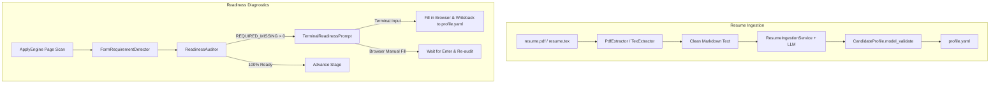

# Resume Ingestion and Readiness Diagnostics Implementation Plan

> **For agentic workers:** REQUIRED SUB-SKILL: Use superpowers:subagent-driven-development to implement this plan task-by-task. Steps use checkbox (`- [ ]`) syntax for tracking.

**Goal:** Implement resume file parsing from PDF/TeX into `CandidateProfile` YAML and stage-by-stage missing required fields readiness diagnostics with interactive terminal resolution and profile persistence.

**Architecture:**
1. **`ResumeIngestion`**: Extracts raw text using local `PdfExtractor` (`pypdf`) and `TexExtractor` (LaTeX syntax cleaning), transforms text into `CandidateProfile` using schema-constrained LLM structured output via standard OpenAI-compatible API, validates through Pydantic, and writes to `profile.yaml`.
2. **`ReadinessDiagnostics`**: Detects required fields in the DOM via HTML attributes and class markers, compares them against mapped values, identifies `REQUIRED_MISSING` fields, prompts the user interactively with a Rich table in the terminal, fills elements, and synchronizes newly supplied facts back to `profile.yaml`.

**Architecture Diagram:**



**Tech Stack:** Python 3.11+, Pydantic v2, Typer, Rich, PyYAML, pypdf, httpx, Playwright.

## Global Constraints
- Strictly Local-first: PDF and TeX text extraction runs 100% locally; LLM calls use standard OpenAI-compatible endpoints with configurable base URL (allowing local Ollama).
- All facts extracted into `CandidateProfile` must be strictly validated by Pydantic v2 schemas; zero unvalidated dictionaries.
- TDD required: Every task must implement failing tests first, pass tests, pass spec-review, pass code-review, and commit.
- Anti-Hallucination: Prompts must explicitly instruct the model to extract only verifiable facts and leave unmentioned fields `null`.

---

### Task 1: 简历文本多格式抽取器 (PdfExtractor & TexExtractor)

**Files:**
- Modify: `pyproject.toml` (add `pypdf>=4.0.0`)
- Create: `applypilot/modules/profile/ingestion/__init__.py`
- Create: `applypilot/modules/profile/ingestion/extractors.py`
- Create: `tests/unit/profile/test_extractors.py`

**Interfaces:**
- Produces:
  - `TextExtractor(Protocol)`: `extract_text(self, file_path: Path) -> str`
  - `PdfExtractor`: extracts text from PDF pages, normalizes whitespace.
  - `TexExtractor`: strips LaTeX comments (`%`), unwraps environments (`itemize`, `tabular`), strips styling macros (`\textbf`, `\textit`, `\vspace`, etc.).

- [ ] **Step 1: Write the failing test for extractors**

```python
# tests/unit/profile/test_extractors.py
import pytest
from pathlib import Path
from applypilot.modules.profile.ingestion.extractors import PdfExtractor, TexExtractor

def test_tex_extractor_cleans_macros_and_comments(tmp_path: Path):
    tex_file = tmp_path / "resume.tex"
    tex_content = r"""
    % This is a header comment
    \documentclass{article}
    \begin{document}
    \textbf{张三} \\
    \href{mailto:zhangsan@example.com}{zhangsan@example.com} | 13800138000
    \section{教育经历}
    \begin{itemize}
        \item 清华大学 \hfill 计算机科学与技术 (硕士)
    \end{itemize}
    \end{document}
    """
    tex_file.write_text(tex_content, encoding="utf-8")
    
    extractor = TexExtractor()
    cleaned = extractor.extract_text(tex_file)
    
    assert "This is a header comment" not in cleaned
    assert "\\textbf" not in cleaned
    assert "\\begin" not in cleaned
    assert "张三" in cleaned
    assert "zhangsan@example.com" in cleaned
    assert "清华大学" in cleaned

def test_pdf_extractor_non_existent_file(tmp_path: Path):
    extractor = PdfExtractor()
    with pytest.raises(FileNotFoundError):
        extractor.extract_text(tmp_path / "missing.pdf")
```

- [ ] **Step 2: Run test to verify it fails**

Run: `uv run pytest tests/unit/profile/test_extractors.py -v`  
Expected: FAIL with ModuleNotFoundError: No module named 'applypilot.modules.profile.ingestion'

- [ ] **Step 3: Add `pypdf` to `pyproject.toml` and implement extractors**

Update `pyproject.toml` dependencies with `"pypdf>=4.0.0"`.

Implement `applypilot/modules/profile/ingestion/extractors.py`:
- Implement `TextExtractor(Protocol)`
- Implement `PdfExtractor` using `pypdf.PdfReader`
- Implement `TexExtractor` using regex to clean LaTeX commands, comments, and environments.

- [ ] **Step 4: Run test to verify it passes**

Run: `uv run pytest tests/unit/profile/test_extractors.py -v`  
Expected: PASS

- [ ] **Step 5: Commit**

```bash
git add pyproject.toml uv.lock applypilot/modules/profile/ingestion/ tests/unit/profile/test_extractors.py
git commit -m "feat(profile): implement PdfExtractor and TexExtractor for local resume parsing"
```

---

### Task 2: 简历结构化转换引擎 (ResumeIngestionService)

**Files:**
- Create: `applypilot/modules/profile/ingestion/service.py`
- Modify: `applypilot/modules/profile/ingestion/__init__.py`
- Create: `tests/unit/profile/test_ingestion_service.py`

**Interfaces:**
- Produces: `ResumeIngestionService(api_key: Optional[str] = None, base_url: Optional[str] = None, model: Optional[str] = None)`:
  - `async def parse_text(self, text: str) -> CandidateProfile`
  - `async def parse_file(self, file_path: Path) -> CandidateProfile`

- [ ] **Step 1: Write the failing test for ResumeIngestionService**

```python
# tests/unit/profile/test_ingestion_service.py
import pytest
from pathlib import Path
from unittest.mock import AsyncMock, patch
from applypilot.domain.profile import CandidateProfile
from applypilot.modules.profile.ingestion.service import ResumeIngestionService

@pytest.mark.asyncio
async def test_resume_ingestion_service_parsing(tmp_path: Path):
    tex_file = tmp_path / "resume.tex"
    tex_file.write_text(r"\textbf{李四} 手机: 13900000000 邮箱: lisi@example.com", encoding="utf-8")
    
    mock_response = {
        "schema_version": "1.1.0",
        "profile_id": "cand_lisi",
        "identity": {"name": "李四"},
        "contact": {"mobile": "13900000000", "email": "lisi@example.com"},
        "education": [],
        "experiences": [],
        "projects": [],
        "skills": []
    }
    
    service = ResumeIngestionService(api_key="test_key")
    with patch.object(service, "_call_llm_json", new_callable=AsyncMock) as mock_call:
        mock_call.return_value = mock_response
        profile = await service.parse_file(tex_file)
        
        assert isinstance(profile, CandidateProfile)
        assert profile.identity.name == "李四"
        assert profile.contact.mobile == "13900000000"
```

- [ ] **Step 2: Run test to verify it fails**

Run: `uv run pytest tests/unit/profile/test_ingestion_service.py -v`  
Expected: FAIL with ModuleNotFoundError or ImportError

- [ ] **Step 3: Implement ResumeIngestionService**

Implement `applypilot/modules/profile/ingestion/service.py`:
- Reads API key and base URL from arguments or environment variables (`APPLYPILOT_LLM_API_KEY`, `OPENAI_API_KEY`, `APPLYPILOT_LLM_BASE_URL`, `OPENAI_BASE_URL`).
- Selects `PdfExtractor` or `TexExtractor` based on file suffix.
- Calls OpenAI-compatible chat completion endpoint using `httpx.AsyncClient`.
- Enforces JSON output conforming to `CandidateProfile`.
- Validates returned JSON via `CandidateProfile.model_validate(data)`.

- [ ] **Step 4: Run test to verify it passes**

Run: `uv run pytest tests/unit/profile/test_ingestion_service.py -v`  
Expected: PASS

- [ ] **Step 5: Commit**

```bash
git add applypilot/modules/profile/ingestion/ tests/unit/profile/test_ingestion_service.py
git commit -m "feat(profile): implement ResumeIngestionService with schema-constrained LLM parsing"
```

---

### Task 3: CLI 简历导入命令 (`applypilot profile import`)

**Files:**
- Modify: `applypilot/cli/main.py`
- Create: `tests/e2e/test_cli_profile_import.py`

**Interfaces:**
- Produces: `applypilot profile import -f <path> [-o <output>] [--model <model>] [--base-url <url>] [--api-key <key>]`

- [ ] **Step 1: Write the failing test for profile import command**

```python
# tests/e2e/test_cli_profile_import.py
from pathlib import Path
from unittest.mock import AsyncMock, patch
from typer.testing import CliRunner
from applypilot.cli.main import app
from applypilot.domain.profile import CandidateProfile, IdentityInfo, ContactInfo

runner = CliRunner()

def test_cli_profile_import_smoke(tmp_path: Path):
    tex_file = tmp_path / "resume.tex"
    tex_file.write_text(r"张三 13800000000", encoding="utf-8")
    out_yaml = tmp_path / "output_profile.yaml"
    
    mock_profile = CandidateProfile(
        profile_id="cand_zhangsan",
        identity=IdentityInfo(name="张三"),
        contact=ContactInfo(mobile="13800000000")
    )
    
    with patch("applypilot.modules.profile.ingestion.service.ResumeIngestionService.parse_file", new_callable=AsyncMock) as mock_parse:
        mock_parse.return_value = mock_profile
        res = runner.invoke(app, ["profile", "import", "-f", str(tex_file), "-o", str(out_yaml), "--api-key", "dummy"])
        
        assert res.exit_code == 0
        assert out_yaml.exists()
        assert "Profile successfully imported" in res.stdout
```

- [ ] **Step 2: Run test to verify it fails**

Run: `uv run pytest tests/e2e/test_cli_profile_import.py -v`  
Expected: FAIL with "No such command 'import'"

- [ ] **Step 3: Implement `profile import` command in `applypilot/cli/main.py`**

Add `import_profile` command to `profile_app` in `applypilot/cli/main.py`:
- Validates existence of input file.
- Calls `ResumeIngestionService.parse_file`.
- Serializes profile to YAML using `yaml.dump`.
- Prints colored summary and confirmation.

- [ ] **Step 4: Run test to verify it passes**

Run: `uv run pytest tests/e2e/test_cli_profile_import.py -v`  
Expected: PASS

- [ ] **Step 5: Commit**

```bash
git add applypilot/cli/main.py tests/e2e/test_cli_profile_import.py
git commit -m "feat(cli): add profile import command supporting PDF and TeX resumes"
```

---

### Task 4: 必填项精准特征嗅探器 (FormRequirementDetector)

**Files:**
- Create: `applypilot/modules/apply/readiness.py`
- Create: `tests/unit/apply/test_readiness_detector.py`

**Interfaces:**
- Produces: `FormRequirementDetector.is_field_required(element_attrs: dict, label: str, outer_html: Optional[str] = None) -> bool`

- [ ] **Step 1: Write the failing test for FormRequirementDetector**

```python
# tests/unit/apply/test_readiness_detector.py
from applypilot.modules.apply.readiness import FormRequirementDetector

def test_detect_html_required_attributes():
    assert FormRequirementDetector.is_field_required({"required": ""}, "姓名") is True
    assert FormRequirementDetector.is_field_required({"aria-required": "true"}, "手机") is True
    assert FormRequirementDetector.is_field_required({"type": "text"}, "姓名") is False

def test_detect_asterisk_in_label():
    assert FormRequirementDetector.is_field_required({}, "* 政治面貌") is True
    assert FormRequirementDetector.is_field_required({}, "政治面貌*") is True
    assert FormRequirementDetector.is_field_required({}, "政治面貌 (选填)") is False
    assert FormRequirementDetector.is_field_required({}, "备注 (optional)") is False

def test_detect_class_markers_in_outer_html():
    outer = '<div class="el-form-item is-required"><label>常住城市</label></div>'
    assert FormRequirementDetector.is_field_required({}, "常住城市", outer_html=outer) is True
```

- [ ] **Step 2: Run test to verify it fails**

Run: `uv run pytest tests/unit/apply/test_readiness_detector.py -v`  
Expected: FAIL with ModuleNotFoundError: No module named 'applypilot.modules.apply.readiness'

- [ ] **Step 3: Implement FormRequirementDetector**

Implement `applypilot/modules/apply/readiness.py`:
- `is_field_required`: Checks HTML `required`, `aria-required="true"`, label asterisks, CSS classes `is-required`, `required`, `star`, `must`, and respects explicit optional keywords (`选填`, `optional`).

- [ ] **Step 4: Run test to verify it passes**

Run: `uv run pytest tests/unit/apply/test_readiness_detector.py -v`  
Expected: PASS

- [ ] **Step 5: Commit**

```bash
git add applypilot/modules/apply/readiness.py tests/unit/apply/test_readiness_detector.py
git commit -m "feat(apply): implement FormRequirementDetector for ATS required field sniffing"
```

---

### Task 5: 阶段就绪度审计与终端交互补全器 (ReadinessAuditor & Synchronizer)

**Files:**
- Modify: `applypilot/modules/apply/readiness.py`
- Modify: `applypilot/modules/apply/__init__.py`
- Create: `tests/unit/apply/test_readiness_auditor.py`

**Interfaces:**
- Produces:
  - `FieldReadinessStatus` (StrEnum: `FILLED`, `OPTIONAL_EMPTY`, `REQUIRED_MISSING`)
  - `FieldReadinessItem` (BaseModel)
  - `ReadinessReport` (BaseModel: `is_ready: bool`, `missing_required: list[FieldReadinessItem]`)
  - `ReadinessAuditor.audit_fields(scanned_fields: list[dict], profile: CandidateProfile, variant: Optional[ResumeVariant]) -> ReadinessReport`
  - `ProfileWritebackSynchronizer.sync_field(profile_path: Path, profile_path_key: str, value: Any)`

- [ ] **Step 1: Write the failing test for ReadinessAuditor and Synchronizer**

```python
# tests/unit/apply/test_readiness_auditor.py
from pathlib import Path
from applypilot.domain.profile import CandidateProfile, IdentityInfo, ContactInfo
from applypilot.modules.apply.readiness import (
    ReadinessAuditor,
    FieldReadinessStatus,
    ProfileWritebackSynchronizer
)

def test_readiness_auditor_flags_missing_required():
    profile = CandidateProfile(
        profile_id="c1",
        identity=IdentityInfo(name="张三"),
        contact=ContactInfo(mobile=None)
    )
    
    fields = [
        {"field_sig": "name", "label": "* 姓名", "is_required": True, "mapped_path": "identity.name"},
        {"field_sig": "mobile", "label": "* 手机号", "is_required": True, "mapped_path": "contact.mobile"},
        {"field_sig": "remark", "label": "备注", "is_required": False, "mapped_path": None},
    ]
    
    report = ReadinessAuditor.audit_fields(fields, profile)
    assert report.is_ready is False
    assert len(report.missing_required) == 1
    assert report.missing_required[0].field_sig == "mobile"
    assert report.missing_required[0].status == FieldReadinessStatus.REQUIRED_MISSING

def test_profile_writeback_synchronizer(tmp_path: Path):
    profile_yaml = tmp_path / "profile.yaml"
    profile_yaml.write_text("identity:\n  name: 张三\ncontact:\n  mobile: null\n", encoding="utf-8")
    
    ProfileWritebackSynchronizer.sync_field(profile_yaml, "contact.mobile", "13800000000")
    
    updated = profile_yaml.read_text(encoding="utf-8")
    assert "13800000000" in updated
```

- [ ] **Step 2: Run test to verify it fails**

Run: `uv run pytest tests/unit/apply/test_readiness_auditor.py -v`  
Expected: FAIL with AttributeError / ImportError

- [ ] **Step 3: Implement ReadinessAuditor and ProfileWritebackSynchronizer**

Implement in `applypilot/modules/apply/readiness.py`:
- `ReadinessAuditor.audit_fields` loops over scanned items, resolves values, marks `FILLED`, `OPTIONAL_EMPTY`, or `REQUIRED_MISSING`.
- `ProfileWritebackSynchronizer.sync_field` safely parses YAML, navigates dot-separated key, updates value, and writes back.
- Re-export in `applypilot/modules/apply/__init__.py`.

- [ ] **Step 4: Run test to verify it passes**

Run: `uv run pytest tests/unit/apply/test_readiness_auditor.py -v`  
Expected: PASS

- [ ] **Step 5: Commit**

```bash
git add applypilot/modules/apply/readiness.py applypilot/modules/apply/__init__.py tests/unit/apply/test_readiness_auditor.py
git commit -m "feat(apply): implement ReadinessAuditor and ProfileWritebackSynchronizer"
```

---

### Task 6: ApplyEngine 阶段就绪度闭环集成与端到端验证

**Files:**
- Modify: `applypilot/modules/apply/engine.py`
- Modify: `applypilot/cli/main.py`
- Create: `tests/unit/modules/test_engine_readiness.py`

**Interfaces:**
- Produces: Integrated `ApplyEngine` with `interactive_readiness: bool = True` option, interactive terminal resolver callback, and automatic missing required field handling.

- [ ] **Step 1: Write the failing test for ApplyEngine readiness integration**

```python
# tests/unit/modules/test_engine_readiness.py
import pytest
from pathlib import Path
from applypilot.storage.database import init_db
from applypilot.domain.profile import CandidateProfile, IdentityInfo, ContactInfo
from applypilot.domain.job import Job, ApplicationTarget
from applypilot.modules.apply.engine import ApplyEngine

class MockInteractiveBrowser:
    def __init__(self):
        self.paused_reason = None
    async def open_page(self, url: str): return None
    async def current_page(self): return None
    async def wait_for_user(self, reason: str):
        self.paused_reason = reason
    async def close(self): pass

@pytest.mark.asyncio
async def test_engine_halts_on_missing_required_field(tmp_path: Path):
    db_path = tmp_path / "test.db"
    await init_db(db_path)
    
    # Profile with missing phone number
    profile = CandidateProfile(
        profile_id="cand_test",
        identity=IdentityInfo(name="张三"),
        contact=ContactInfo(mobile=None)
    )
    
    job = Job(
        job_id="job_req_test",
        title="开发工程师",
        company_name="测试集团",
        description_raw="岗位要求",
        source_channel="url",
        source_url="https://example.com",
        apply_url="https://example.com/apply"
    )
    target = ApplicationTarget(target_id="tgt_1", job=job)
    
    browser = MockInteractiveBrowser()
    engine = ApplyEngine(db_path=db_path, browser_backend=browser)
    
    status = await engine.run_application_target(target, profile)
    assert status == "ready_review"
```

- [ ] **Step 2: Run test to verify it fails or needs readiness hook**

Run: `uv run pytest tests/unit/modules/test_engine_readiness.py -v`

- [ ] **Step 3: Integrate ReadinessAuditor into `ApplyEngine` and add CLI flag**

In `applypilot/modules/apply/engine.py`:
- In the stage loop, use `FormRequirementDetector` during scanning to detect `is_required`.
- Run `ReadinessAuditor.audit_fields(...)`.
- If `report.missing_required` is not empty:
  - If `self.interactive_readiness` is True:
    - Invoke terminal readiness resolver (or mockable handler) to prompt user.
    - If user provides values, fill in page and update profile.
    - If user chooses browser manual fill, call `browser.wait_for_user(...)`.
- In `applypilot/cli/main.py`:
  - Pass `interactive_readiness` to `apply run`.

- [ ] **Step 4: Run test to verify it passes**

Run: `uv run pytest tests/unit/modules/test_engine_readiness.py -v`  
Expected: PASS

- [ ] **Step 5: Run full test suite**

Run: `uv run pytest`  
Expected: All tests pass (>= 195 tests)

- [ ] **Step 6: Commit**

```bash
git add applypilot/modules/apply/engine.py applypilot/cli/main.py tests/unit/modules/test_engine_readiness.py
git commit -m "feat(apply): integrate stage readiness diagnostics and interactive resolution into ApplyEngine"
```
