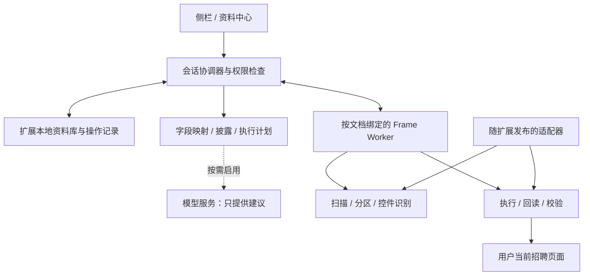

# ApplyPilot 浏览器插件版完整设计方案

日期：2026-09-15
状态：设计基线；基础扩展骨架已实现，完整方案尚未完成，真实站点仍待验收。
代码基线：`e33d3b1f4683a1c3f6e0d7046f887d2c667a8d4c`。
目标：用户在日常浏览器中登录并进入网申页面，点击“开始填写”，使用自己的档案完成可靠、可解释、可纠错的填写。

当前进度（2026-09-15）：已在原仓库新增 WXT Manifest V3 扩展、侧栏入口、中文基础字段规划、当前页/同源 frame 与开放 Shadow DOM 扫描、文本/原生下拉/选择控件填写回读、YAML/JSON 导入、IndexedDB 密码派生 AES-GCM 资料库，以及 TypeScript 核心测试。复杂组件、完整操作日志/恢复、平台适配和真实页面验收仍按后续工作包实施。

本方案定义完整产品范围和工程交付标准。实施阶段用于安排依赖，不代表把复杂控件、附件、恢复等能力排除在交付范围之外。旧 v0.1 设计的范围限制不约束本次插件提案；旧文档仍作为历史记录。

阅读路径：产品体验见第 1–3 节；技术实现见第 4–11 节；开源采用见第 12 节；迁移、测试、实施和发布见第 13–18 节。

## 1. 推荐决策

采用 **独立 Manifest V3 浏览器扩展 + 本地资料库 + 分层表单引擎 + 可选 AI 辅助**。日常填写无需 Python、终端、本地 HTTP 服务或复制 URL。Chrome 与 Edge 纳入正式验收，Windows 为主要使用环境；Firefox 作为独立兼容交付，不能仅凭框架宣称跨浏览器就宣布支持。Safari 暂不承诺发布，但核心逻辑不依赖 Chrome UI。

建议技术栈为 WXT、TypeScript、React、IndexedDB/Dexie、JSON Schema、Vitest、Playwright。版本在开发启动时验证后锁定，不使用浮动依赖。WXT 是 MIT 许可的扩展框架，提供多浏览器构建与扩展入口管理；它解决工程组织问题，不保证招聘网站兼容。[WXT 官方仓库](https://github.com/wxt-dev/wxt)

| 备选路线 | 好处 | 本项目代价 | 决定 |
|---|---|---|---|
| 独立扩展 | 已登录页面直接使用；无需后台进程；本地基础填写 | Python 执行层需移植 | 主路线 |
| 扩展 + 本地 Python 服务 | 较多复用档案解析、数据库 | 安装、端口、认证、版本匹配又形成故障来源 | 可选迁移工具，不作运行前提 |
| 扩展接管调试协议 | 操作能力较强 | 调试权限、附加提示、会话干扰、维护复杂度 | 不纳入标准版 |
| 直接 fork 现有填表插件 | 起步快 | 中文资料模型、质量、许可证和架构不一定匹配 | 选择性复用模块 |

## 2. 现有问题与迁移边界

当前 `applypilot/cli/main.py` 创建和关闭浏览器；`modules/apply/engine.py` 同时处理页面打开、登录判断、阶段跳转、扫描、填写和暂停；`mapper.py` 的通用“学校”规则可指向最高学历，必须结合区块才能用于多段教育。

| 现有体验 | 插件中的处理 | 仍需解决的部分 |
|---|---|---|
| 登录窗口闪退、独立浏览器没有登录态 | 在用户当前页面运行，不创建或关闭网申窗口 | 登录失效时停止当前操作，用户登录后重新扫描 |
| 长 URL、Markdown 链接、导航超时 | 当前标签页直接作为入口 | SPA 切页、iframe、表单渲染仍需检测 |
| 北森/Moka 检测后不继续 | 通用控件能力优先，平台信息仅增强适配 | 平台专属组件与租户差异 |
| 只有一个 PAUSED 状态 | 每个字段显示原因和处理入口 | 依赖字段失败时准确阻止受影响的后续动作 |
| 显示已填写，网站没接受 | 写入后回读、校验、重新渲染后核查 | 页面可见验证不能证明服务器最终保存 |
| 测试全部通过仍然现场失败 | 安装实际扩展测试 + 真实站点场景验收 | 登录后页面需要用户协助提供测试条件 |

已有 415 项测试是 Python 当前覆盖行为的历史结果，不是插件或真实站点的兼容性证明。本方案不预设此前截图只有一个共同根因。

## 3. 完整产品功能

### 3.1 用户路径

首次安装：欢迎页 → 导入档案/简历或手动建档 → 核对解析结果 → 选择默认档案与披露策略 → 使用说明。基础功能无需注册账号，无需模型 API key。

日常使用：打开并登录招聘页 → 点击工具栏图标 → 面板确认当前网站、岗位、档案 → 点击“开始填写” → 自动处理明确匹配且允许填写的字段 → 定位剩余问题 → 用户检查页面并继续。

提供三种模式，默认第一种：

1. **填写当前页**：处理当前表单，结束后显示结果。用户自己点击网站下一步。
2. **预览后填写**：先查看字段、资料来源和拟填值，支持单项排除与改选经历。
3. **辅助连续填写**：用户为本次申请开启后，在经验证的适配器内处理“下一步/保存并继续”。到提交、承诺、验证码、账户操作或无法判断的步骤时交回用户。

多页能力属于完整方案，但只在已验证流程上启用。普通“保存”可能立即写入招聘方服务器，应明确提示此行为。名称类似“保存并提交”的按钮不能作为下一步处理。

### 3.2 界面结构

| 界面 | 内容 |
|---|---|
| 填写侧栏 | 当前标签页与岗位、档案/变体、开始/停止、进度、区块、逐字段结果、重试与撤销 |
| 资料中心（扩展页） | 基础信息、多段教育/经历、国企扩展、附件、回答库、版本与导入导出 |
| 申请记录 | 企业/岗位/周期、使用的档案版本、待办、填写历史、用户确认的投递状态 |
| 网站与纠错 | 授权网站、平台能力、个人映射规则、停用/删除规则 |
| 设置与诊断 | 披露、AI、数据保存期限、备份、快捷键、脱敏诊断导出 |

Chrome 提供扩展侧栏 API；打开侧栏受用户操作条件约束。使用工具栏点击建立入口和临时授权，面板不能因为显示着就假定拥有新标签页权限。[Chrome Side Panel 文档](https://developer.chrome.com/docs/extensions/reference/api/sidePanel)

建议侧栏信息示例：

```text
科大讯飞 · 当前填写页           档案：校招技术岗
[开始填写] [预览]              [停止]

教育经历    8 项已填写 / 2 项待处理
✓ 本科学校   来源：本科教育
! 硕士专业   网站有两个相近选项  [选择]
! 毕业日期   档案只有年月       [补充]

已填 18 · 保留 6 · 待处理 4 · 未验证 1
[定位下一项] [重试未完成项] [撤销本次可恢复修改]
```

支持键盘导航、读屏、清晰焦点、非纯颜色状态、窄屏和缩放、中文长标签、中英双语字段。页面高亮只指向当前项，不持续抢焦点或滚动。关闭面板、切到其他标签页时在当前安全操作结束后暂停；不得为了继续运行强行聚焦用户窗口。

### 3.3 完整范围与明确限制

完整交付包括：多档案与岗位变体、结构化导入、复杂控件、重复区块、附件选择与可支持的自动上传、纠错、局部重试、恢复、有限撤销、申请记录、可选 AI、诊断、跨浏览器测试和安装更新。

限制：最终提交由用户完成；密码/验证码不进入候选人资料映射；不会绕过网站验证码或访问限制；不能承诺任意网站都能自动填写。无法自动操作时必须有定位、复制和人工选项，不能静默跳过。批量找岗位、群发投递和招聘信息聚合不是本次填表产品的必需范围。

## 4. 系统架构与责任边界



| 组件 | 职责 | 不应持有/执行 |
|---|---|---|
| 扩展 UI | 资料编辑、确认、进度、问题处理 | 不依赖 popup 生命周期维持任务 |
| Service worker | 消息路由、授权、任务协调、日志提交、模型请求 | 不存唯一一份任务状态，不直接操作 DOM |
| 每个 frame 的 content script | 扫描本 frame、元素注册、执行有限动作、回读 | 不拿完整档案、API key、其他岗位数据 |
| core 纯逻辑包 | 模型、映射、计划、规范化、策略 | 不依赖 Chrome API、DOM、Python 运行时 |
| 控件驱动 | 处理已识别控件的交互与验证 | 不独自决定资料事实和是否允许披露 |
| 平台适配器 | 给出平台/租户区块、控件、步骤提示 | 不绕过统一策略和操作验证 |
| 数据层 | 事务、版本、附件、日志、迁移 | 不使用网页 origin 的 localStorage 保存档案 |

content script 使用隔离执行环境，默认不读取站点框架内部变量。确有必要的主世界桥接只采用打包的固定函数和严格参数，页面侧响应仍需当作不可信数据验证；桥接不是安全边界。[Chrome Content Scripts 文档](https://developer.chrome.com/docs/extensions/develop/concepts/content-scripts)

### 4.1 消息与身份协议

每条消息包含 `protocolVersion / requestId / runId / documentEpoch / operationId / type`，身份还绑定浏览器提供的 `tabId / frameId / documentId / origin`。以运行时 sender 为准，不能相信消息正文自报的身份。

后台签发的运行授权限定档案版本、目标文档、动作集合和有效期。网页文本、DOM attribute、`window.postMessage` 无权发起资料读取、模型请求或填写任务。内容脚本只接受扩展运行时下发的、已授权的操作；不开放外部消息调用入口。

跨进程消息采用可验证的 JSON 结构。附件按受限长度分块编码并校验哈希，不能假设所有浏览器消息通道都能直接传 Blob。所有枚举、字段引用、值长度、URL 和操作数有上限；响应超时产生明确错误。

## 5. 资料、附件与历史模型

延续现有 CandidateProfile / ResumeVariant / DisclosurePolicy 的事实与表达分离，但扩展存储协议采用有版本的 JSON Schema；TypeScript 类型和运行时校验从同一协议生成。Python 导出同一交换格式，通过双向黄金样例确保 PartialDate、TriState、枚举和空值语义一致。

| 实体 | 关键字段与行为 |
|---|---|
| Profile | profileId、schemaVersion、revision、核对状态、身份/联系/教育/经历/项目/技能/国企字段 |
| Fact | 稳定 factId、来源、用户确认时间、原始值与精度；未知与明确否定分开 |
| Variant | 引用事实 ID，选择/排序经历、岗位表达；不覆盖主档案事实 |
| Asset | assetId、内容哈希、文件名、MIME、大小、材料类型、关联经历、版本、敏感度、Blob 引用 |
| Answer | 问题主题、回答正文、事实引用、字数/语言、适用岗位、确认状态 |
| SiteMemory | 网站/租户/表单模板/区块/字段语义 → profile path 或用户选择；有版本和停用机制 |
| Application | 企业、岗位 ID、招聘周期、用户选定档案；URL 仅为辅助定位 |
| FillRun | 档案 revision、页面文档身份、adapterVersion、计划、状态、摘要 |
| Operation | 操作 ID、字段指纹、前置条件、结果、证据级别、时间、错误码 |

教育经历使用稳定 ID，不能按数组顺序猜本科/硕士；学历和学位分开。出生日期、起止日期保留年/月/日精度，不能补造 1 日。至今、无此经历、未知、拒绝披露分别表达。不得默认民族、政治面貌、健康情况、亲属关系或承诺答案。

岗位去重优先使用平台明确岗位 ID + 招聘周期；不得把 userId/resumeId 当岗位 ID。未知平台使用用户确认的记录，避免激进删除 URL 参数导致不同岗位合并。敏感原始 URL 如需恢复，放入加密私有字段；日志和分享材料只保留脱敏地址。

### 5.1 导入与编辑

支持现有 YAML/JSON、PDF、DOCX、纯文本和单文件 LaTeX 文本提取。PDF.js 处理 PDF，Mammoth 只提取 DOCX 文本，不把不可信转换 HTML 直接渲染。扫描件可选择本地 OCR 模块；需要下载模型时先显示大小和用途，失败仍可手动建档。[PDF.js](https://github.com/mozilla/pdf.js)、[Mammoth](https://github.com/mwilliamson/mammoth.js)

资料解析区分“提取原文”与“理解并生成结构化档案”。模型解析是可选项；结果进入待核对草稿，展示原文定位与冲突，不直接替换现有档案。导入提供新增/合并预览，重复经历以稳定 ID 和内容辅助匹配；附件路径从 Python 导入后标为“需要重新选择文件”。

限制文件大小、页数、压缩展开量、解析时长和 YAML 别名深度；取消可停止任务。备份导入先验证格式、版本和附件哈希，在临时事务中迁移，全部成功后切换；失败不破坏原数据。

### 5.2 本地存储与加密

IndexedDB 保存档案、附件和事务记录，Dexie 封装迁移；chrome.storage.local 保存少量非敏感设置，storage.session 保存当前会话所需的短期信息。私有 storage 设置 `TRUSTED_CONTEXTS`，资料不暴露给所有 content script。[Chrome Storage 文档](https://developer.chrome.com/docs/extensions/reference/api/storage)、[Dexie](https://github.com/dexie/Dexie.js)

提供密码解锁的本地资料库：随机数据密钥，使用 Web Crypto 的 AES-GCM 加密数据，密码派生密钥用于包裹数据密钥；每条加密记录使用独立随机 nonce，携带版本与记录 ID 作为附加认证数据。密码派生参数在目标设备基准测试后确定并写入格式版本，不自创加密算法。

解锁密钥只在受信任扩展会话中保存，以实现后台休眠后的受控续用；锁定、浏览器重启、扩展更新或超时后清除。锁定取消后续操作并清理内容脚本内待填数据；已交给网页的值无法通过锁定收回。密码忘记时只能使用用户持有的备份/恢复材料，不声称有无条件找回能力。

加密备份包括档案、附件、规则、历史和 schemaVersion；显示导出内容、最近备份时间、剩余空间。卸载会丢失扩展本地数据，设置页需明确说明。云同步作为独立可选能力，采用客户端加密和冲突处理；正式本地版不依赖云账号，不用 storage.sync 保存候选人档案。加密防护不等于能防御已解锁设备上的恶意扩展或系统入侵。

## 6. 页面扫描与表单理解

### 6.1 扫描对象

覆盖原生 input/select/textarea、radio/checkbox 组、contenteditable、ARIA textbox/combobox/listbox、日期区间、上传控件和页面校验提示。排除搜索框、站点导航、密码/验证码、支付、隐藏字段、不可编辑项和插件自身 UI。

不把“存在任意 input”当作表单已准备完成。就绪判断结合可见可编辑控件、当前区块、遮罩、局部 loading 状态及 DOM 稳定窗口；不以 networkidle 作为条件。建议初始扫描稳定窗口 300–500ms，等待预算 15s，超出显示继续等待/重新扫描；这些是待性能测试调整的设计参数。

标签证据优先级：关联 label / aria-labelledby → fieldset legend 与区块标题 → 邻近标签 → placeholder/name → 平台规则。扫描保留证据来源与冲突，而不是拼出一个标签字符串就直接匹配。

### 6.2 分区与重复记录

先识别基本信息、教育、工作、项目、家庭等 Section，再识别 Section 内的 RecordGroup，最后映射 Field。“紧急联系人姓名”与“本人姓名”必须依赖所属区块区分。

重复区块采用一对一分配：页面已有记录用学校/单位/日期等共同匹配档案；空白组依据组标题或用户指定记录；不同组不能默认引用同一条最高学历。排序变化与 DOM 重建后重算关系。记录不唯一时显示候选经历，不强行选择。

### 6.3 iframe、Shadow DOM 与 SPA

各 frame 独立扫描，由后台汇总。activeTab 只提供主 frame origin 的临时权限；跨域 frame 需要对应 host 权限。按需请求实际嵌入 origin，拒绝授权则明确显示“该内嵌表单未扫描”，避免报告零字段即完成。[activeTab 官方说明](https://developer.chrome.com/docs/extensions/develop/concepts/activeTab)、[可选权限 API](https://developer.chrome.com/docs/extensions/reference/api/permissions)

递归扫描开放 Shadow DOM，包括其内部再嵌套的 roots；为每层注册有限观察器并清理。封闭 Shadow DOM 在标准 DOM 路线中标为不可访问，不承诺通用穿透。[MDN shadowRoot](https://developer.mozilla.org/en-US/docs/Web/API/Element/shadowRoot)

SPA 的 documentId 可能不变，因此额外维护 documentEpoch、表单版本和路由指纹。URL 不变但表单切换同样作废旧字段引用。元素使用会话内注册 ID 和定位证据，不把 CSS selector 当长期唯一身份；虚拟列表节点复用也须检查当前语义。

## 7. 映射、决策与 AI

映射输出至少包含 `fieldRef / profilePath / recordId / evidence / decision / reason / proposedValue`。资料查找与执行操作分离。

决策顺序：

1. 检查目标文档、字段用途、可编辑性和披露策略。
2. 使用当前网站、租户、区块、档案范围内的用户确认映射。
3. 使用精确语义词典与上下文规则；处理学历/学位、入学/毕业、本人/亲属等冲突。
4. 分析选项、类型和约束，验证拟填值是否合法且候选唯一。
5. 无法决定时提供人工改选；用户启用 AI 后可获取辅助建议。

不用固定的“0.85”冒充校准概率。状态采用“规则唯一确定 / 用户已确认 / 有歧义 / 缺资料 / 不支持”；如引入数值置信度，必须从独立标注集校准，再决定自动填写阈值。

AI 用途：识别难标签、把问答匹配到事实、基于已确认经历起草开放题、解释缺失原因。模型只能返回限定的字段引用或回答草稿，不能返回 JS、任意点击脚本、任意资料读取路径。确定性校验器再次检查事实路径、枚举、披露、字数和目标文档；过期响应直接丢弃。

开放题显示引用的事实与修改差异；没有事实支持的薪资、成绩、年限、获奖和能力结论不得自动补造。人工确认的岗位表达可进入回答库。

模型请求默认只带字段标签、区块、选项和必要事实片段；页面、招聘描述和简历文本均作为不可信数据，不接受其中要求泄露资料或改变操作目标的指令。发送前展示服务商及数据范围，敏感内容单独披露控制；key 不发送到 content script，不放到日志、URL、普通备份或云同步。

支持自定义兼容模型服务，模型名称由配置选择，费用/请求次数设上限；429/超时退避重试有界，取消会中止请求。远程服务使用 HTTPS；用户主动配置的本机服务单独授权精确 origin。模型不可用时普通规则填写仍可运行。

## 8. 复杂控件执行策略

| 控件/场景 | 执行与验证 | 不确定时的处理 |
|---|---|---|
| 文本/文本域 | 使用所属文档 realm 的原生 setter，触发需要的 input/change，检查重渲染后的值 | 保留结果并标记未验证；不无限重打 |
| React/Vue 受控组件 | 先走标准事件，按验证过的驱动补充流程 | 不把修改 DOM 值视为框架必然接受 |
| 原生 select | 精确值/规范化选项匹配，排除禁用和占位项，确认唯一性 | 多个相近选项让用户选 |
| 自定义搜索下拉 | 打开目标弹层→输入查询→等待结果→在关联 listbox 中选择→回读选中状态 | 不在整个 document 模糊点击任意 option |
| 虚拟化选项 | 在目标列表中有界滚动、去重和停止条件 | 预算用完提示手动选，不无限滚动 |
| 省市区/学校专业级联 | 按依赖顺序填写上级，等待下级重建后重新定位 | 父项失败则阻塞其子项，其他区块继续 |
| 日期与范围 | 部分日期、至今、年月日分拆、区间一致性 | 缺精度请用户补，不假定某天 |
| radio/checkbox | 按组与选项语义设置目标状态，避免二次点击反转 | 承诺、授权和隐私勾选交用户处理 |
| 富文本 | 文本或已验证编辑器接口，保留段落与换行，回读可见文本 | 无法验证时提供复制，不塞任意 HTML |
| 重复经历 | 匹配已有条目，再有界添加缺少的条目；每次新增后确认结构变化 | 新增响应不明先重扫，不重复创建 |
| 延迟校验/自动保存 | 等待字段相关错误与保存提示，标注验证证据层级 | 保存超时与本地已填分开显示 |
| 动态必填项 | 父字段改变后增量重扫；更新依赖图 | 不对隐藏或未激活问题编造回答 |

synthetic events 不能伪造 `isTrusted`。某些站点只接受真实用户交互时，标准扩展应请求用户操作该控件，不能承诺模拟任何输入。[MDN isTrusted](https://developer.mozilla.org/en-US/docs/Web/API/Event/isTrusted)

### 8.1 附件完整设计

用户在资料中心主动选择文件，扩展保存受控的本地 Blob；不能凭 `C:\\...` 路径读取任意文件。上传前比较材料类型、关联经历、扩展名、MIME、站点大小/数量要求、文件版本；简历、成绩单、证书不能互相兜底。

普通 file input 可研究从用户已授权的文件构造 FileList 并触发站点处理，但必须在浏览器/组件测试中验证。读取选中文件名只代表选中，不代表上传成功；应继续检查上传进度、错误和完成提示。[MDN input.files](https://developer.mozilla.org/en-US/docs/Web/API/HTMLInputElement/files)

跨扩展/页面传输使用有大小上限的分块与哈希，完成即释放临时缓存，不暴露永久可访问的附件 URL。自定义上传器、拖放区或必须真实选择的控件提供定位上传入口与文件名提示，用户手动选取。若站点给出的压缩/尺寸限制无法满足，提供生成派生文件的预览，保留原文件，不静默裁掉内容。

## 9. 执行计划、幂等、恢复和撤销

执行计划是依赖图。例如“新增硕士记录 → 学历 → 学校搜索 → 专业 → 日期”，失败只阻塞关联子图。单个页面内串行执行会改变 DOM 的动作；可并行做纯扫描和资料解析，但不同时打开多个下拉框。

建议初始预算：普通控件 5s、远程搜索/级联 15s、上传 60s；每字段最多 2 次有理由的重试，每轮结构重扫最多 3 次，连续步骤最多 20 次且检测循环。预算可由适配器显式覆盖并显示原因，最终数值经真实场景调整。

运行状态：

```text
IDLE → SCANNING → PLANNING → FILLING → VERIFYING → COMPLETED / PARTIAL
                       ↘ NEEDS_INPUT / WAITING_PAGE / PERMISSION_REQUIRED
任意活动状态 → PAUSED_USER / CANCELLED / STALE_DOCUMENT / INTERRUPTED
```

页面完成与申请已提交是两个状态维度。`COMPLETED` 只代表计划内的当前页操作完成；仍要显示未扫描区块、未验证项和未保存提示。

### 9.1 操作协议

每次写入前：

1. 确认任务有效、当前文档/区块/元素一致、权限未撤销。
2. 确认当前值符合计划前置条件；用户新填的内容不覆盖。
3. 在 IndexedDB 事务中记录 `PREPARED` 操作与有限撤销信息，再派发动作。
4. content script 验证操作授权与操作 ID，执行一次，返回回读与校验结果。
5. 后台记录 `VERIFIED / FAILED / UNKNOWN`，更新进度。

DOM 与 IndexedDB 不能组成一个原子事务，系统不能保证所有动作 exactly-once。ACK 丢失时进入 UNKNOWN 并重扫：普通文本已匹配则确认完成；新增条目、上传、下一步等非幂等操作绝不能盲重放。

同一标签页只能有一个写入任务；不同标签页分别绑定任务和档案。切换档案产生新计划，不改变正在执行计划的事实快照。工作线程重启、端口断开或扩展更新后，UI 读取日志并与存活文档握手；没有一致证据则要求重新扫描。

Manifest V3 后台可能被卸载，因此使用小批次有界执行，状态持久化；不靠定时 ping 维持后台永生。[Service Worker 生命周期](https://developer.chrome.com/docs/extensions/develop/concepts/service-workers/lifecycle)

### 9.2 局部重试和撤销

重试仅覆盖失败/未完成项，已成功项和用户修改项保持。每次重试重新检查元素、候选项和依赖，不复用过期 selector。

撤销只处理仍等于本次写入值的字段，并在逆依赖顺序中逐项验证；用户之后改过的内容跳过。更改上级字段会清空下级时，提示连带影响。网站自动保存、上传文件、跨页跳转、新增/删除经历不承诺可逆；不能把“撤销 DOM 值”说成撤回服务器数据。

## 10. 平台适配与能力发布

优先验证用户实际使用的科大讯飞表单、51job 承载的中移表单，再覆盖北森其他租户、Moka，之后按实际案例扩展智联、牛客和自建系统。企业名称与技术平台分别记录，中移不同招聘业务可能使用不同系统。

适配器提供 `detect / annotateSections / detectComponents / planRecordCreation / identifySafeTransition / verifyTransition`。通用引擎仍拥有策略与动作审计。平台检测是弱证据集合，不以一个域名或全局变量绝对判定。

每个适配器记录支持域名、租户差异、控件矩阵、测试样例、最近人工验收日期、浏览器版本、已知限制。兼容等级为“通用识别 / 控件已验证 / 多步骤已验证”，不能统一标成“支持北森”。

个人纠错保存语义绑定与限制条件，可撤销、导出和删除；页面模板变化后降级为建议。不得默默收集用户每次键入作为纠错，也不把某网站的映射无条件推广到其他网站。

规则与驱动随扩展版本打包。可导入的个人配置只允许有限的选择器/语义声明，不允许 JS、远程执行或任意表达式；即使声明式配置也要校验动作与目标范围。远程修复采用商店/正式版本发布，不通过下载 JS 绕过审查。[Chrome 远程托管代码说明](https://developer.chrome.com/docs/extensions/develop/migrate/remote-hosted-code)

## 11. 权限和数据边界

| 权限/能力 | 采用方式 |
|---|---|
| activeTab、scripting | 用户点击后扫描/填写当前页面 |
| storage、sidePanel | 配置、会话和侧栏 |
| 可选网站 host 权限 | 用户需要跨域 iframe 或固定网站连续使用时按 origin 请求 |
| 模型服务 host 权限 | 用户主动配置服务时请求对应 origin |
| contextMenus | 启用右键单字段填写时使用 |
| downloads | 若采用下载 API 导出备份/附件则按实现声明；普通下载能满足时不额外申请 |
| cookies、debugger、history、webRequest | 标准版不申请 |
| unlimitedStorage | 先做配额和附件清理；确有需求时说明用途并单独评估 |

授权随时可撤销；扫描须区分“不存在”和“无权访问”。浏览器设置页、扩展商店等受限页面显示不可运行，不能陷入重试。隐私模式默认不运行，若用户主动启用则提示资料共享边界并单独测试。

为支持任意用户主动选择的招聘网站，可在 manifest 声明可选 HTTP(S) host 范围，但不在安装时授予所有网站访问权；运行时只请求实际所需 origin。切换到未经授权的新标签页时，引导再次点击工具栏图标或授权网站，不能把侧栏已有会话权限搬过去。

页面是数据接收方，填入的值可能被页面脚本立即读取或自动保存；因此披露策略必须在写入前执行，而非以“尚未提交”作为保密保证。账号密码、短信验证码、支付信息排除在通用字段映射外；身份证、政治面貌、家庭资料按本次申请授权。

默认不开遥测。诊断导出采用字段级白名单，包含版本、错误码、控件类型、脱敏结构、规则 ID 和步骤耗时；默认不含原值、附件、完整 HTML、Cookie、token、API key、完整查询串。截图和 DOM 样本须由用户选取、预览后导出；文本标签也可能含隐私，不能只删除 input.value 就认为脱敏完成。

保存期限建议：档案与附件保留到用户删除；申请记录用户管理；脱敏运行日志默认 30 天；撤销所需旧值加密保存至当前运行结束后 24 小时或用户提前清除；诊断临时文件导出后释放。设置页允许缩短期限、一键清除历史和导出后删除，删除操作说明是否包含附件与备份。使用期间定期按到期时间清理，不依赖后台持续存活。

### 11.1 错误分类与用户处理入口

| 内部错误码 | 用户看到的原因 | 恢复动作 |
|---|---|---|
| PERMISSION_REQUIRED | 此内嵌表单需要网站访问权限 | 授权具体网站或手动填写 |
| NO_APPLICATION_FORM | 当前未发现申请表单 | 进入填写步骤后重新扫描 |
| PAGE_LOADING | 页面仍在加载填写内容 | 继续等待/重新扫描 |
| AMBIGUOUS_MAPPING | 无法确定对应哪段经历或资料 | 选择来源并决定是否记住 |
| MISSING_FACT | 档案没有这项信息 | 补充档案或仅填本次 |
| OPTION_NOT_FOUND | 网站没有找到对应选项 | 修改搜索词或手动选择 |
| VALUE_REJECTED | 页面未保留填入值或显示校验错误 | 定位字段并按站点规则处理 |
| USER_CONFLICT | 检测到你已经修改此字段 | 保留用户值，重新预览可选覆盖 |
| STALE_DOCUMENT | 页面或区块已发生变化 | 取消旧动作并重新扫描 |
| OUTCOME_UNKNOWN | 操作可能已完成，但没有确认结果 | 核查页面；不自动重复添加/上传 |
| ASSET_INVALID | 附件类型、大小或版本不匹配 | 选择匹配材料 |
| STORAGE_UNAVAILABLE | 资料库暂不可写或空间不足 | 停止新写入，备份/清理/恢复 |
| UNSUPPORTED_WIDGET | 此控件需要手动操作 | 定位、复制资料、手动完成 |

用户只看中文解释和可执行按钮；代码和技术细节收进诊断区。字段失败不直接变成整个申请失败，只有文档失效、权限/数据安全问题或用户停止才中止整轮。

## 12. 开源项目调研与采用结论

调研日期为 2026-09-15。以下检查了仓库元数据、目录和列出的关键代码；未安装运行候选产品，也未完成其安全审计。GitHub 的更新时间/星数不作质量保证。引用固定 commit，避免后续代码变化影响判断。

### 12.1 同类产品

| 项目与检查版本 | 实际检查结果 | 采用建议 |
|---|---|---|
| [AutoApply](https://github.com/geckguy/AutoApply/tree/6c5fbc42833278acaa45981e86b5d99ae97d77a0)，MIT，`6c5fbc4` | 扩展 + 本地 Python；有 scraper、filler、frame 与行为测试。文本 setter 和格式回读可借鉴；自定义下拉仍全 document 查选项并 includes 匹配 | 优先审查文本/回读与测试思路；下拉实现需重写，不继承本地服务前提 |
| [Jobestry](https://github.com/sharmanilay/jobestry/tree/e0269444071f3c78c756f1a7c754532091bfd5a8)，MIT，`e026944` | form-detector 中有标签提取、开放 shadow roots 和同源 iframe 搜索；查看的 roots 搜索并不构成完整嵌套递归，异常多处被忽略 | 借鉴标签证据、问题定位；拆分模块并补跨 frame 和异常诊断 |
| [ApplyAI](https://github.com/muhammad-saadd/applyai/tree/d4a97b5643aa219592883a43b068fc18dff94678)，MIT，`d4a97b5` | 有平台分文件结构；generic.js 排除 checkbox/radio/file，fieldName 用非 ASCII 字符替换，纯中文标签可能变成空标识 | 仅参考结构和交互；中文扫描核心自行实现 |
| [jobfill](https://github.com/23aaaa/jobfill/tree/2d9b43822d03e609f86db1c39d0f28616efd2dcf)，`2d9b438` | 主题与中文网申接近；GitHub API license 为 null，检查的仓库文件树未发现 LICENSE | 可观察产品思路，许可证明确前不复制代码或素材 |

代码依据：[AutoApply filler](https://github.com/geckguy/AutoApply/blob/6c5fbc42833278acaa45981e86b5d99ae97d77a0/extension-chrome/content/filler.js#L303)、[AutoApply 下拉](https://github.com/geckguy/AutoApply/blob/6c5fbc42833278acaa45981e86b5d99ae97d77a0/extension-chrome/content/filler.js#L420)、[Jobestry roots](https://github.com/sharmanilay/jobestry/blob/e0269444071f3c78c756f1a7c754532091bfd5a8/pages/content/src/form-detector.ts#L1644)、[ApplyAI 中文标识处理](https://github.com/muhammad-saadd/applyai/blob/d4a97b5643aa219592883a43b068fc18dff94678/content_scripts/generic.js#L43)。

许可证依据：[AutoApply LICENSE](https://github.com/geckguy/AutoApply/blob/6c5fbc42833278acaa45981e86b5d99ae97d77a0/LICENSE)、[Jobestry LICENSE](https://github.com/sharmanilay/jobestry/blob/e0269444071f3c78c756f1a7c754532091bfd5a8/LICENSE)、[ApplyAI LICENSE](https://github.com/muhammad-saadd/applyai/blob/d4a97b5643aa219592883a43b068fc18dff94678/LICENSE)。

这些是抽查到的代码边界，不是对整个项目质量的全面结论。无需因发现局部问题全部拒绝复用，但每个引入片段必须有本项目用例验证。

### 12.2 基础库

| 库 | 用途与选型 | 许可证/落实方式 |
|---|---|---|
| [WXT](https://github.com/wxt-dev/wxt) | 扩展入口、构建、多浏览器产物；建议采用 | MIT，安装时保留许可并锁版本 |
| [Plasmo](https://github.com/PlasmoHQ/plasmo) | 可行替代框架，本方案不同时引入两套 | MIT；本次仅核对元数据与根目录，不作性能优劣断言 |
| [Dexie](https://github.com/dexie/Dexie.js) | IndexedDB 事务与迁移 | Apache-2.0，选定版本复核 notices |
| [Zod](https://github.com/colinhacks/zod) | 内部消息校验可采用；不另造冲突的交换协议 | MIT；与 JSON Schema 的职责明确区分 |
| [yaml](https://github.com/eemeli/yaml) | 旧档案导入导出 | ISC；限制复杂输入并测试空值/日期 |
| [PDF.js](https://github.com/mozilla/pdf.js) | PDF 本地文本提取与预览 | Apache-2.0；worker 与依赖打包在扩展中 |
| [Mammoth](https://github.com/mwilliamson/mammoth.js) | DOCX 本地文本提取 | BSD-2-Clause；转换内容仍是不可信输入 |
| [Playwright](https://playwright.dev/docs/chrome-extensions) | 扩展安装与浏览器流程测试 | 依赖版本与浏览器一起固定；不作为用户运行依赖 |

真正采用时建立 `THIRD_PARTY_NOTICES.md`，记录上游 URL、commit/版本、文件范围、修改内容、许可证和依赖扫描结果。本次项目根目录也未找到 LICENSE；正式发布前需明确 ApplyPilot 自身许可证，不能默认所有公开源码都可无限制再分发。商标、图标、测试数据不因代码 MIT 自动获得授权。

## 13. 现有代码迁移与建议目录

| 现有模块 | 处理 |
|---|---|
| domain/profile.py、variant.py、base.py | 提取交换 schema 与样例，保留 Python 输入输出兼容 |
| mapper.py、normalizer.py、profile/resolver.py | 移植规则与纯逻辑，补上下文；旧行为有 bug 时以修正后的语义为准 |
| adapters/applications/* | 复用语义与场景，DOM 操作按扩展环境重做 |
| browser/playwright_backend.py | 保留 CLI；不将 Playwright 包进插件 |
| apply/engine.py | 不直接翻译大循环，拆为扫描、规划、执行、验证与恢复 |
| storage/* | 保留 SQLite；提供版本化交换与可选历史导出，不在扩展内直接读取 SQLite |
| tests/* | 提取有效行为样例并加入扩展测试；不搬只验证 mock 调用次数的断言 |

建议在当前仓库新增 TypeScript workspace：

```text
apps/extension/
  entrypoints/            # background、content、sidepanel、options
  ui/                     # 资料中心、填写结果、诊断
  services/               # 浏览器权限、会话、文件、模型请求
packages/
  schema/                 # 交换格式、迁移、黄金样例
  core/                   # mapping、policy、planner、normalizer
  dom/                    # scanner、sections、registry、verification
  drivers/                # native、combobox、cascade、date、upload
  adapters/               # generic、beisen、51job、moka、租户增强
  storage/                # IndexedDB、加密、操作记录、备份
tests/extension/
  fixtures/               # 去隐私、可独立运行的行为页面
  integration/            # 实际扩展消息与注入测试
  e2e/                    # 安装扩展的浏览器端到端测试
  acceptance/             # 真实站点人工验收记录
docs/compatibility/       # 控件、租户、版本、已知问题矩阵
```

关键接口以单向数据流保持边界：

```ts
type FieldRef = {
  documentId: string;
  epoch: number;
  frameId: number;
  localId: string;
  fingerprint: string;
};

// 示意契约；完整定义在实施阶段落入 schema。
interface ComponentDriver {
  inspect(ref: FieldRef): Promise<FieldSnapshot>;
  execute(action: AuthorizedAction): Promise<ActionReceipt>;
  verify(action: AuthorizedAction): Promise<VerificationResult>;
}
```

驱动不能收到整个 Profile，也不能通过 action 自带任意 selector 扩大操作目标。planner 根据已扫描字段和固定 revision 生成动作；执行器逐项校验。

## 14. 测试、验收与兼容性证据

### 14.1 测试层次

1. 纯逻辑：中文标签/反例、上下文、日期精度、枚举、否定/未知、披露、纠错范围、导入迁移。
2. 组件行为：真实 DOM 与 React/Vue 页面；选项异步出现、虚拟列表、重渲染、级联、上传、重复记录。
3. 真扩展集成：加载构建产物，验证用户点击授权、content script 注入、跨 frame、消息校验、加密存储、worker 重启。
4. 故障注入：ACK 丢失、导航中写入、关闭面板、权限撤销、切换档案、存储满、备份损坏、API 超时、旧版本消息。
5. 真实站点人工验收：科大讯飞与指定 51job/中移填写流程；用户登录后检查实际组件和错误提示，逐个记录证据。

Playwright 官方说明扩展测试需要带扩展的持久化 Chromium 上下文；不能只用普通 page 测试替代扩展测试。CI 采用其支持的 Chromium 路线，正式 Chrome/Edge 的安装与交互另做人工验收。[Playwright 扩展测试文档](https://playwright.dev/docs/chrome-extensions)

真实页面不能把带 token、简历、身份证或招聘方私有数据的 HTML 直接提交进仓库。可将必要结构改造为脱敏 fixture，但静态 HTML 无法复现异步行为，需补行为脚本。真实账户不放进公开 CI；没有登录条件时该验收项标为待验证，不用本地样例替代完成声明。

### 14.2 必须通过的场景

| 类别 | 验收要求 |
|---|---|
| 基础使用 | 用户日常浏览器已登录，点击即扫描并填；无需 CLI、URL 配置、另起窗口 |
| 正确映射 | 本科/硕士、本人/联系人、学历/学位不串值；选择来源可追溯 |
| 重复点击 | 不并行写、不重复添加经历、不清掉已有选择 |
| 人工修改 | 输入中暂停该字段；重试和撤销不覆盖用户后改内容 |
| 动态网页 | iframe 权限缺失有提示；SPA/虚拟节点变更后旧动作失效 |
| 恢复 | worker 终止、消息丢失后无重复非幂等动作；无法确认的操作显示待核查 |
| 复杂表单 | 学校/专业搜索、地址级联、年月、至今、多记录、附件状态均有用例 |
| 隐私 | content script 不可读取整库/key；导出诊断不含凭据和原始字段值 |
| 多页 | 可识别下一步才执行；循环停止；提交/承诺按钮不误点 |
| 浏览器 | Windows Chrome/Edge 正式安装通过；macOS Chrome 回归；Firefox 独立矩阵 |
| 降级 | 模型断网普通填表可用；不支持项可定位和手动完成 |

### 14.3 指标与发布门槛

不以“通过多少测试”作为主要指标。每次发布统计字段发现召回率、映射准确率、自动写入后验证成功率、人工介入率、错误覆盖次数、恢复成功率，按控件/平台/浏览器分组。分别报告全部可见申请字段和“档案有值且允许自动填”的字段，避免把跳过项从统计中隐藏。

建议发布目标：独立标注集上自动决策准确率 ≥99%；声明支持的确定性控件测试集 100% 通过；错误覆盖、跨记录串填、误提交与敏感值越权为零容忍阻断项。发现召回率和介入率展示实际分母及样例规模，不用小样本声称全站 99%。这些是验收目标，当前未测得。

性能目标在约定 Windows 参考设备测量：300 字段页首次扫描 P95 ≤2s，50 个普通字段本地填验 ≤10s（不含站点异步等待）；大量 DOM 扫描分片，避免 >50ms 连续主线程阻塞。输入页面保持可交互；附件、解析和模型任务独立预算。性能未达标时先定位扫描重复和观察器泄漏。

## 15. 实施工作包与交付物

以下每项均属于完整方案。阶段之间设置可观察成果，避免一次性堆功能后才发现核心架构不成立。

| 工作包 | 依赖 | 交付物 | 验证 |
|---|---|---|---|
| A. 真实案例基线与协议 | 无 | 两个目标站点的场景清单、脱敏 fixture 规范、交换 schema、风险清单、依赖许可清单 | 页面与代码证据区分；旧档案黄金样例通过 |
| B. 扩展骨架与资料库 | A | WXT 构建、侧栏、权限、档案导入编辑、加密与备份 | Chrome/Edge 安装；拒绝权限、锁定、存储迁移测试 |
| C. 扫描与上下文映射 | A/B | frames、shadow roots、区块、记录分配、语义决策与预览 | 中文歧义、隐藏控件、重复教育、导航失效测试 |
| D. 执行与恢复 | B/C | 原生驱动、计划日志、回读、取消、幂等、局部重试、有限撤销 | 安装真实扩展进行中断/重启/冲突测试 |
| E. 复杂组件与附件 | C/D | 搜索/级联/日期/富文本/重复记录/附件驱动与诊断 | 实际组件库行为测试；每驱动声明边界 |
| F. 平台完整场景 | C/D/E | 科大讯飞、51job/中移、北森/Moka 能力矩阵与多步骤支持 | 登录后人工验收；错误提示、保存和继续行为核查 |
| G. 智能辅助与资料增强 | B/C | AI 映射建议、问答草稿、PDF/DOCX/OCR 导入、变体和回答库 | 事实核对、发送范围、恶意提示、断网/限额测试 |
| H. 记录与产品完善 | D/F | 申请记录、纠错管理、快捷键、无障碍、多语言、诊断包 | 用户自助定位问题；提交状态与填写状态分开 |
| I. 发布与维护 | B–H | 完整测试报告、浏览器包、商店材料、隐私说明、恢复手册 | 固定产物复测、许可证/依赖扫描、升级与回退测试 |

关键路径 A→B→C→D→E→F→I。G/H 可在依赖满足后穿插；它们不是另立产品，也不能绕过核心回归。尚未测量两个站点登录后组件数量，不承诺固定日历日期；A 完成后按实际驱动与场景数量估算，并区分开发工期、用户验收等待和商店审核时间。

## 16. 发布、升级、维护与故障处理

开发版提供明确版本的“加载已解压扩展”包；正式版分别提交 Chrome Web Store 与 Edge Add-ons。用户只安装扩展产物，不要求安装 Node。商店账号、素材及发布批准在实际发布阶段落实；本方案不等于本次已授权发布。

CI 执行锁文件安装、类型检查、lint、纯逻辑测试、真实扩展集成、依赖审计、构建、产物检查。发布同一个已测试包，附版本、源码 commit、能力矩阵、校验值和第三方 notices。禁止扩展运行时下载执行代码；PDF worker、依赖脚本随包发布。

数据库迁移有版本与备份；旧版遇到新 schema 时只读并提示升级，不能强行降级写坏数据。紧急回退优先发布更高版本的修复包并停用有问题的适配器；已变更的数据需要兼容迁移，不假设降级二进制即可恢复。

用户报错流程：面板看到具体错误 → 定位字段或重试 → 导出预览后的脱敏诊断 → 开发者复现 → 加行为回归 → 更新驱动 → 在能力矩阵记录修复版本。日志包含 extension/schema/adapter/browser 版本、frame 权限状态、最后确认操作和错误分类，从根本上避免再次只能凭终端截图猜原因。

## 17. 高风险点与处置

| 风险 | 早期验证或处置 |
|---|---|
| 两个站点租户结构不同 | A 阶段记录实际页面与控件，不按公司名称推断平台 |
| 页面填写后又清空 | 异步回读、组件状态和错误提示验证；保留未验证状态 |
| 复杂控件只认真实事件 | 在目标页面验证；保留人工选取入口，不承诺扩展能绕过 |
| 多记录新增重复 | 操作日志、结构核对；ACK 不明时停止自动重放 |
| 资料与附件泄露 | 受信任扩展存储、最小消息载荷、披露门、诊断白名单 |
| 模型猜测事实/读到页面指令 | 限定输出协议、事实引用、确定性复核、人工确认草稿 |
| 规则网站改版 | 模板指纹、规则版本、降级、脱敏样例和兼容性更新时间 |
| 本地数据库或升级损坏 | 事务迁移、导入校验、用户备份、只读恢复 |
| 依赖代码引入旧 bug | 固定来源、逐模块审查、本项目行为测试、许可记录 |
| 多端数据冲突 | 本地版明确档案 revision；可选同步保留冲突副本，不静默覆盖 |

## 18. 方案评审结论

推荐落地为完整的本地浏览器填表助手：用户掌握登录与最终提交，扩展负责资料、表单理解、可靠执行与具体问题处理。优先采用成熟扩展基础库，选择性借鉴 AutoApply 与 Jobestry 的实现经验；中文上下文映射、复杂控件安全选择和中断恢复作为本项目核心能力建设。

进入实现前无需再决定“做不做最小 MVP”；需要在工作包 A 明确的是两个实际页面的控件清单、正式支持浏览器范围和项目发布许可证。默认设计为 Windows Chrome/Edge、离线基础填写、AI 可选、当前页优先且提供经验证的连续模式。登录后尚无法观察的行为保持待验收，不用推测填补。
